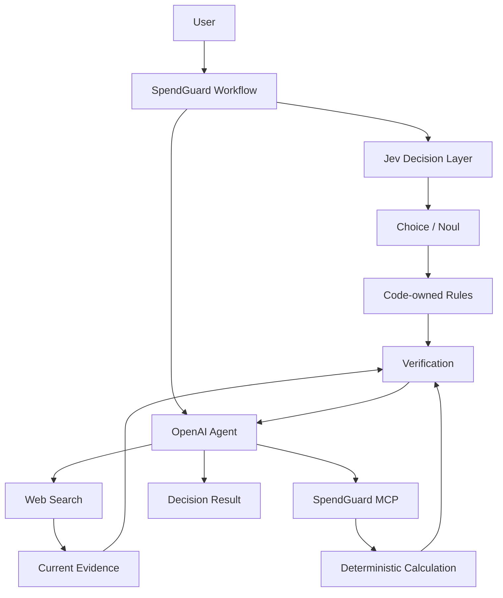

# SpendGuard 프로젝트 기획서

> Jev, OpenAI Agent, MCP를 분리해 구매·구독·계약·생활비 의사결정을 계산·비교·검증하는 프로젝트

## 1. 프로젝트 목적

사용자의 소비 관련 질문을 자연어로 입력받고, 필요한 정보 확인·좁은 의미 판단·결정론적 계산·최신 정보 조사·선택지 비교를 거쳐 검증 가능한 판단 근거를 제공한다.

프롬프트 모음이나 자유 형식 상담 서비스가 아니라 역할이 분리된 의사결정 workflow 구현과 검증을 목표로 한다.

## 2. 문제 정의

소비 의사결정에서 하나의 생성형 모델에 모든 작업을 맡기면 아래 문제가 발생할 수 있다.

- 질문 유형과 필요한 정보의 불명확성
- 금액·이자·기간 계산의 재현성 부족
- 현재 가격·요금제·정책의 최신성 문제
- 근거와 가정의 혼합
- 자유 형식 출력의 검증 비용
- 모델 판단과 실제 정책 코드의 경계 불명확

SpendGuard는 판단, 계산, 외부 정보 확인, 설명을 분리한다.

## 3. 핵심 원칙

- 결론 우선
- 사실과 추정 분리
- 변동 정보 최신 확인
- 사용자 의견에 대한 무조건적 동의 금지
- 선택지 비교
- 필수 데이터 누락 확인
- 숫자 기반 설명
- 사용자 조건 우선
- 잘못된 전제 수정
- 최종 결과 검증
- 계산 로직과 모델 판단 분리
- 모델 판단과 코드 정책 분리
- 현재 Phase 범위 준수

## 4. 계획 아키텍처

Workflow의 최종 제어 흐름과 threshold는 애플리케이션 코드가 소유한다.

## 5. 역할 분리

### Jev

좁고 닫힌 answer space를 가진 의미 판단에 사용한다.

초기 검증 대상:

- 소비 질문 Intent 분류
- 현재 정보 검색 필요 여부
- 질문의 의미적 모호성 여부

Jev는 TypeSafe의 typed decision 결과와 probability/confidence를 반환하는 용도로 사용한다.

초기 구현에서는 `Choice`와 `Noul`을 우선 검증한다.

`Score`는 실제 Decision Pack에서 연속적 척도 판단이 필요한 사례가 확인된 경우에만 추가한다.

### OpenAI Agent

- 복합 추론
- 사용자 요청 해석
- Tool orchestration
- Web Search 질의 구성
- 근거 통합
- 사용자용 최종 설명

### Code

- 필수 필드 규칙
- 단위와 타입 검증
- confidence threshold 정책
- Tool 호출 전후 검증
- 계산식
- side effect 제한
- 최종 workflow 분기

명확한 규칙은 모델에게 묻지 않는다.

### MCP

- 할부 계산
- 대출 변경 계산
- 사용당 비용 계산
- TCO 계산
- 연간 비용 계산
- 비용 비교
- 반복 지출 정규화

MCP Server에는 결정론적 기능만 둔다.

### Web Search

- 현재 가격
- 현재 상품 조건
- 현재 요금제
- 공식 정책
- 프로모션
- 제품 사양

## 6. Jev 적용 원칙

Jev는 최종 구매 결정을 대신하는 모델로 사용하지 않는다.

금지:

- 금액 계산
- 이자 계산
- 최종 구매 여부 단독 결정
- 자동 결제
- 자동 계약
- 고정되지 않은 정책 생성

허용:

- 닫힌 선택지 분류
- Yes/No semantic judgment
- 평가를 거친 confidence 기반 routing

confidence는 정확도 보장이 아니다.

자동 분기 threshold는 Phase 2 평가 결과 없이 정하지 않는다.

## 7. Decision Pack

| Pack | 처리 대상 |
| --- | --- |
| Purchase | 제품 구매, 중고, 대체재, 구매 시점 |
| Recurring Cost | 구독, 통신비, 반복 지출 |
| Finance Cost | 할부, 대출 변경 |
| Ownership Cost | 자동차 등 장기 보유 비용 |
| Quote Audit | 견적서, 계약 비용 |
| Budget Optimization | 장보기, 여행, 최근 지출 |

보험과 카드 관련 기능은 사용자 제공 조건의 비용·중복 비교 범위로 제한한다.

## 8. 계획 기술 스택

| 구분 | 기술 |
| --- | --- |
| Language | Python 3.13 |
| API | FastAPI |
| Generative Agent | OpenAI Agents SDK |
| LLM API | OpenAI Responses API |
| Decision Model | TypeSafe Jev |
| TypeSafe SDK | `typesafe-sdk` |
| MCP | FastMCP |
| HTTP | HTTPX |
| Validation | Pydantic |
| Test | pytest |
| Frontend | HTML / CSS / JavaScript |
| MCP Transport | stdio 우선 |

## 9. 데이터 정책

초기 버전에서 사용자 금융 계정과 직접 연결하지 않는다.

저장하지 않는 정보:

- 카드번호
- 계좌번호
- 주민등록번호
- 인증 정보
- 금융회사 로그인 정보

초기 구현은 현재 요청 처리에 필요한 입력만 사용한다.

## 10. 결과 구조

최종 결과는 최소한 아래 항목을 구분한다.

- 결론
- 사용자 제공 사실
- 외부 확인 사실
- 가정
- 계산
- 선택지
- 위험
- 실행 항목
- 출처

Jev의 내부 판단 결과는 사용자 결론 자체가 아니라 workflow 근거 중 하나로 취급한다.

## 11. Phase

### Phase 0. Repository Bootstrap

목표:

- 저장소 구조 정리
- 문서 역할 분리
- Git 초기화
- Codex 공통 규칙 정리
- Phase workflow Skill 구성

### Phase 1. Core Agent Baseline

목표:

- Jev 도입 전 OpenAI 기반 baseline 확보

구현:

- Python 프로젝트 초기화
- FastAPI
- OpenAI Agent
- 자연어 질문
- Intent 분류
- 필수 정보 식별
- Structured Output
- 기본 Web UI
- 고정 평가 데이터 생성

제외:

- Jev
- MCP
- 실제 비용 계산
- Web Search

### Phase 2. Jev Decision Layer Evaluation

목표:

- Jev가 SpendGuard의 좁은 판단 레이어에 적합한지 실측 비교

구현:

- 공식 `typesafe-sdk`
- `TYPESAFE_API_KEY`
- Intent `Choice`
- 필요한 경우 `Noul` 기반 semantic gate
- probability / confidence 기록
- Phase 1과 동일한 평가 데이터 사용

비교:

- Intent 정확도
- routing 오류
- latency
- 호출 비용
- confidence와 실제 정답 관계

원칙:

- Phase 1 baseline과 조건을 맞춰 비교
- 평가 결과 없이 Jev 우위 주장 금지
- 검증된 판단만 후속 workflow에 사용
- threshold는 평가 결과를 근거로 결정

### Phase 3. Calculation Tools

목표:

- 모델과 계산 로직 분리

구현:

- 할부 계산
- 대출 변경 계산
- 연간 지출 계산
- 사용당 비용 계산
- TCO 계산
- 비용 비교

모든 계산은 고정 입력과 예상값으로 테스트한다.

### Phase 4. MCP Server

목표:

- Calculation Tool을 MCP Tool로 분리

구현:

- 독립 MCP Server
- 독립 MCP Client
- Agent에서 MCP 호출
- 기존 Function Tool과 MCP 결과 비교

### Phase 5. Current Information Research

목표:

- 변동 정보의 최신성 확보

구현:

- Web Search
- 공식 출처 우선
- 출처 기록
- 조회 시각 기록
- 외부 사실과 Agent 설명 분리

### Phase 6. Decision Packs

목표:

- 실제 소비 의사결정 workflow 구성

구현 대상:

- Purchase
- Recurring Cost
- Finance Cost
- Ownership Cost
- Quote Audit
- Budget Optimization

Jev, Code, MCP, Agent 중 어느 계층이 각 판단을 담당하는지 명시한다.

### Phase 7. End-to-End Evaluation

목표:

- 전체 workflow 품질 검증

평가:

- 계산 정확도
- Intent 정확도
- 필수 입력 식별
- 외부 사실 출처
- 근거 없는 수치
- routing 오류
- Tool 오류 처리
- latency
- 비용
- confidence 기반 분기의 실제 성능

## 12. 평가 원칙

고정 평가 데이터를 사용한다.

모델 비교 시 가능한 범위에서 아래 조건을 유지한다.

- 동일 입력
- 동일 Intent 정의
- 동일 정답 기준
- 동일 실행 환경
- 동일 반복 횟수
- 같은 시점의 가격 기준 기록

모델 제공사가 공개한 benchmark와 프로젝트 자체 실측 결과를 구분한다.

## 13. 범위 제외

초기 프로젝트에서 구현하지 않는다.

- 자동 구매
- 자동 계약
- 자동 구독 해지
- 은행 계좌 연동
- 카드사 계정 연동
- 신용평가
- 투자 자문
- 보험 가입 결정
- 대출 상품 가입 결정
- 브라우저 자동 결제
- 가격 변동 예측 모델
- 사용자 소비 데이터를 이용한 광고

## 14. 성공 기준

### 기능

- 자연어 소비 질문 처리
- 질문 유형 분류
- 필수 정보 누락 감지
- Jev typed judgment 검증
- 결정론적 계산
- MCP Tool 호출
- 최신 데이터 조사
- 선택지 비교
- 근거 표시

### 품질

- 계산 오류 없음
- 외부 사실의 출처 추적 가능
- 사실과 가정 분리
- 같은 계산 입력의 결과 재현 가능
- Tool 호출 과정 추적 가능
- 모델 비교 결과 재현 가능
- 검증되지 않은 confidence 기반 자동 분기 없음

## 15. 기술 근거

Jev 관련 구현은 TypeSafe 공식 문서와 공식 SDK를 우선 기준으로 확인한다.

- TypeSafe AI: https://typesafe.ai/
- Jev 소개: https://typesafe.ai/blog/introducing-system-one-models-and-jev
- Python SDK: https://github.com/typesafe-ai/typesafe-sdk-python
- Workflow Evals: https://evals.typesafe.ai/

외부 서비스의 API, 모델, 가격, 제한은 구현 Phase 시작 시 최신 공식 자료로 다시 확인한다.
