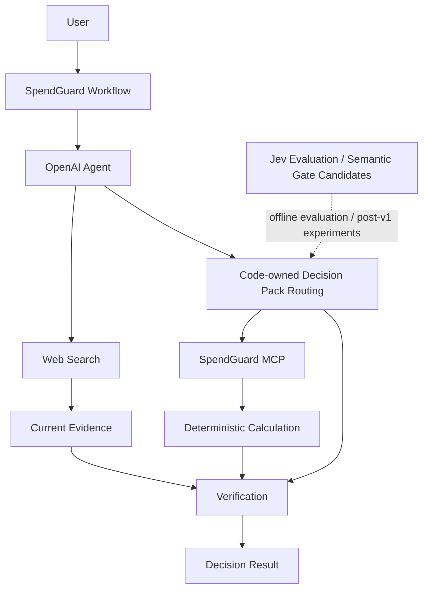

# SpendGuard 프로젝트 기획서

> 구매·구독·계약·생활비 관련 소비 의사결정을 OpenAI Agent, Code, MCP, Web Search로 분리하고, Jev를 좁은 semantic judgment 후보로 평가하는 프로젝트

## 1. 프로젝트 목적

목표:
- 자연어 소비 질문 입력
- 필요한 정보 확인
- 필요한 경우 최신 정보 조사
- 필요한 경우 결정론적 계산
- 선택지 비교
- 근거와 위험 검토
- 검증 가능한 판단 근거 제공
기본 흐름:

```text
질문 입력
→ 필요한 정보 확인
→ 필요한 경우 최신 정보 조사
→ 필요한 경우 결정론적 계산
→ 선택지 비교
→ 근거와 위험 검토
→ 결과 제시

```

프로젝트 성격:
- 프롬프트 모음이 아닌 의사결정 workflow 구현
- 자유 형식 상담 서비스가 아닌 역할 분리형 구조
- 판단·계산·외부 정보 확인·설명의 계층 분리
- v1 Phase 0~7 완료
- 후속 작업의 Product Chapter / Research Track 분리 관리
---

## 2. 문제 정의

소비 의사결정에서 하나의 생성형 모델에 모든 작업을 맡길 때의 문제:
- 질문 유형과 필요한 정보의 불명확성
- 금액·이자·기간 계산의 재현성 부족
- 현재 가격·요금제·정책의 최신성 문제
- 근거와 가정의 혼합
- 자유 형식 출력의 검증 비용
- 모델 판단과 실제 정책 코드의 경계 불명확
- 높은 confidence를 정확도로 오해할 가능성
- 사용자에게 내부 Agent·Tool 구조가 노출되는 UX
역할 분리:

```text
복합 추론          → OpenAI Agent
명확한 정책        → Code
결정론적 계산      → MCP / Calculation
변동 외부 사실     → Web Search
좁은 semantic 판단 → Jev 후보

```

---

## 3. 핵심 원칙

- 결론과 중요한 숫자 우선
- 사실과 추정 분리
- 변동 정보 최신 확인
- 사용자 의견에 대한 무조건적 동의 금지
- 선택지 비교
- 필수 데이터 누락 확인
- 숫자 기반 설명
- 사용자 조건 우선
- 잘못된 전제 수정
- 최종 결과 검증
- 계산 로직과 모델 판단 분리
- 모델 판단과 코드 정책 분리
- 명확한 규칙의 코드 처리
- confidence와 정확도 분리
- 평가 없는 threshold production 적용 금지
- 사용자 UI와 내부 아키텍처 용어 분리
- 실제 사용자 문제 중심 UI
- 미구현 기능의 완료 기능화 금지
- 내부 taxonomy보다 실제 소비 상황 우선
- 사용자 입력 문구의 임의 축약·광고 문구화 금지
---

## 4. 현재 아키텍처



Production workflow 제어:
- Routing 정책 소유: 애플리케이션 코드
- Tool 실행 정책 소유: 애플리케이션 코드
- Jev `Choice`: Phase 2 비교 평가 완료
- Jev production routing: 미적용
---

## 5. 역할 분리

### 5.1 OpenAI Agent

담당:
- 복합 추론
- 사용자 요청 해석
- Tool orchestration
- Web Search 질의 구성
- 검색 결과와 계산 결과 통합
- 사용자용 최종 설명
비담당:
- 결정론적 계산값 직접 생성
- 코드로 확정 가능한 정책 대체
- 최종 side effect 실행

### 5.2 Code

담당:
- Decision Pack routing
- 필수 필드 규칙
- 단위와 타입 검증
- Tool 호출 조건
- fallback
- side effect 제한
- 최종 workflow 분기
- 결과 schema
원칙:
- 명확한 규칙의 코드 처리
- 사용자 미제공 필수값의 임의 생성 금지

### 5.3 MCP / Calculation

현재 제공 Tool:
- `calculate_installment`
- `calculate_refinance`
- `calculate_usage_cost`
- `annualize_expense`
- `calculate_tco`
- `compare_costs`
역할:
- 할부 비용 계산
- 대출 변경 비용 계산
- 사용당 비용 계산
- 연간 비용 환산
- TCO 계산
- 선택지 비용 비교
공통 추적 구조:

```json
{
  "inputs": {},
  "formula": "",
  "intermediate": {},
  "result": {}
}

```

MCP Server 원칙:
- 결정론적 기능 전용
- 모델 추론 로직 제외
- 기존 Calculation Tool 재사용

### 5.4 Web Search

대상:
- 현재 가격
- 현재 상품 조건
- 현재 요금제
- 공식 정책
- 프로모션
- 제품 사양
- 현재 판매 조건
원칙:
- 사용자 제공 사실의 불필요한 재검색 금지
- 계산 가능한 값의 검색 금지
- 외부 사실의 출처 유지
- 외부 사실의 조회 시각 유지
- 검색 결과에 없는 사실의 임의 생성 금지
- 공식 출처 우선

### 5.5 Jev

역할:
- 길게 추론할 필요가 없는 좁은 semantic judgment 후보
- broad Intent classification보다 작은 판단 단위의 후속 검증 대상
Phase 2 실측:
- OpenAI baseline: 16 / 17
- Jev Choice: 16 / 17
- 동일 실패 케이스: `ambiguous-001`
- Jev actual: `budget_optimization`
- 해당 오분류 confidence: 0.99
Phase 2 결론:
- broad Intent routing의 정확도 개선 없음
- production Intent routing 미적용
- confidence threshold 미설정
- narrower semantic gate의 후속 실험 대상으로 유지
---

## 6. Jev 적용 원칙

사용 후보:
- 닫힌 선택지 semantic classification
- 추가 정보 필요 여부 binary semantic gate
- 검색 결과 relevance filtering
- 결과 검증용 narrow judgment
- 강한 Agent 호출 전 사전 필터링
사용 제외:
- 금액 계산
- 이자 계산
- 단위 변환
- 최종 구매 여부 단독 결정
- 명확한 코드 규칙 대체
- confidence 단독 production routing
- 자동 결제
- 자동 계약
- 자동 구독 해지
Confidence 원칙:
- confidence와 정확도 분리
- confidence 0.99 오분류 실측 반영
- confidence 단독 production action 금지
- 평가 결과 없는 threshold 설정 금지
신규 Jev 적용 검증 흐름:

```text
고정 평가 데이터 생성
→ baseline 측정
→ Jev 측정
→ 정확도 / latency / usage / 비용 비교
→ false positive / false negative 확인
→ 적용 여부 결정

```

Production 연결 조건:
- 고정 평가 데이터 기반 검증 완료
- baseline 대비 실질적 이점 확인
- 오류 비용 확인
- threshold 근거 확보
- 기존 production workflow 회귀 검증
---

## 7. Decision Pack

내부 workflow 분류:
| Pack | 처리 대상 |
| --- | --- |
| Purchase | 제품 구매, 중고, 대체재, 구매 시점 |
| Recurring Cost | 구독, 통신비, 반복 지출 |
| Finance Cost | 할부, 대출 변경 |
| Ownership Cost | 자동차 등 장기 보유 비용 |
| Quote Audit | 견적서, 계약 비용 |
| Budget Optimization | 장보기, 여행, 최근 지출 |
원칙:
- Decision Pack의 내부 routing 단위화
- 사용자 기본 UI에서 Pack taxonomy 비노출
- 실제 소비 문제 중심 사용자 인터페이스
- 보험·카드 관련 기능의 사용자 제공 조건 기반 비용·중복 비교 범위 제한
---

## 8. 초기 사용자 시나리오 15종

프로젝트 출발점:
- 실제 소비 절약 문제 15종
- 6개 Decision Pack을 통한 공통 workflow 처리
- 시나리오별 별도 business logic 최소화
- 실제 사용자 언어 중심 UI 구성

### 8.1 시나리오와 Decision Pack 매핑

| No. | 사용자 시나리오 | Decision Pack | 처리 방향 |
| --- | --- | --- | --- |
| 1 | 최저가 비교 | Purchase | 현재 가격 조사, 동일·유사 선택지 비교 |
| 2 | 구독료 다이어트 | Recurring Cost | 반복 비용 정규화, 중복 기능 식별, 절감 후보 비교 |
| 3 | 통신비 점검 | Recurring Cost | 사용 조건, 현재 비용, 요금제 조사, 비용 비교 |
| 4 | 보험 중복 찾기 | Recurring Cost | 사용자 제공 보장 조건과 비용의 중복 비교 |
| 5 | 카드 혜택 최적화 | Budget Optimization | 소비 패턴과 공개 혜택 조건 기반 비교 |
| 6 | 충동구매 방지 | Purchase | 가격, 사용 목적, 사용 빈도, 대체재, 기회비용 비교 |
| 7 | 장보기 예산 절감 | Budget Optimization | 예산·인원 조건 기반 비용 구성과 선택지 비교 |
| 8 | 여행비 최적화 | Budget Optimization | 항공·숙박·교통·식비 조사와 예산 비교 |
| 9 | 자동차 유지비 계산 | Ownership Cost | 보험·세금·연료·정비 등 사용자 입력 기반 TCO 계산 |
| 10 | 할부 vs 일시불 | Finance Cost | 할부 총비용과 일시불 비용 비교 |
| 11 | 대출 갈아타기 계산 | Finance Cost | 기존 조건과 신규 조건의 잔여 비용 비교 |
| 12 | 견적서 바가지 체크 | Quote Audit | 견적 항목 구조화, 외부 가격 조사, 비용 차이 확인 |
| 13 | 가격 협상 준비 | Quote Audit | 외부 가격·견적 근거 기반 협상 가능 항목 정리 |
| 14 | 연간 새는 돈 찾기 | Budget Optimization | 반복 지출 정규화, 연간 환산, 절감 후보 비교 |
| 15 | 구매 전 최종 심사 | Purchase | 지금 구매·대기·중고·대체품 선택지 비교 |
Routing 원칙:
- 시나리오 이름 문자열 기반 routing 금지
- 실제 입력의 Intent 기반 처리
- Required Data 기반 처리
- 검색 필요 여부 기반 처리
- 계산 필요 여부 기반 처리
- 공통 Decision Pack workflow 재사용
- 공통 UI Component 재사용

### 8.2 사용자용 Prompt Template

15개 시나리오 버튼 클릭 시 질문 입력창에 채우는 기본 템플릿:
| 시나리오 | Prompt Template |
| --- | --- |
| 최저가 비교 | `[제품명]을 사려고 해. 같은 제품뿐 아니라 비슷한 대안까지 찾아서 가격과 조건을 비교해줘.` |
| 구독료 다이어트 | `지금 결제 중인 구독 목록을 줄게. 기능이 겹치거나 거의 쓰지 않는 서비스를 찾아서 무엇부터 정리하면 좋을지 알려줘.` |
| 통신비 점검 | `현재 요금제와 월 데이터 사용량을 줄게. 필요 이상으로 내고 있는 비용이 있는지 보고, 더 맞는 요금제가 있는지 비교해줘.` |
| 보험 중복 찾기 | `가입한 보험 보장 내용을 줄게. 서로 겹치는 보장과 필요 이상으로 많이 들어간 부분이 있는지 구분해줘.` |
| 카드 혜택 최적화 | `한 달 소비내역을 줄게. 내 지출 패턴에서 실제로 받을 수 있는 카드 혜택을 비교하고 어디서 가장 많이 아낄 수 있는지 계산해줘.` |
| 충동구매 방지 | `[제품명]을 [가격]원에 살까 고민 중이야. 얼마나 자주 쓸지, 대체할 방법은 없는지, 이 돈을 다른 데 썼을 때까지 고려해서 사도 괜찮은지 따져줘.` |
| 장보기 예산 절감 | `일주일 식비는 [예산]원이고 [인원]명이 먹어. 재료를 최대한 돌려 쓰면서 예산 안에서 장볼 목록과 식단을 짜줘.` |
| 여행비 최적화 | `[여행지]로 [기간] 동안 여행할 거야. 여행 만족도는 크게 떨어뜨리지 않으면서 항공·숙박·교통·식비를 줄일 수 있는 방법을 찾아줘.` |
| 자동차 유지비 계산 | `[차량]을 보유하면 보험료, 세금, 연료비, 정비비, 감가상각까지 포함해서 앞으로 5년 동안 실제로 얼마가 드는지 계산해줘.` |
| 할부 vs 일시불 | `[가격]원짜리 제품을 [금리]%로 [개월]개월 할부하려고 해. 일시불과 비교해서 실제로 얼마를 더 내는지 계산해줘.` |
| 대출 갈아타기 계산 | `대출잔액 [잔액]원, 현재 금리 [금리]%, 남은 기간 [기간]이야. 금리를 [새 금리]%로 낮췄을 때 총이자가 얼마나 줄어드는지 계산해줘.` |
| 견적서 바가지 체크 | `받은 견적서를 붙여넣을게. 가격이 유독 높아 보이는 항목, 꼭 필요한 항목, 빼거나 조정해볼 만한 항목을 구분해줘.` |
| 가격 협상 준비 | `[상품/서비스] 계약을 앞두고 있어. 가격이나 조건에서 협상해볼 만한 부분을 찾아주고, 실제로 어떻게 말하면 좋을지도 써줘.` |
| 연간 새는 돈 찾기 | `최근 3개월 지출내역을 줄게. 만족도는 거의 떨어뜨리지 않으면서 줄일 수 있는 지출을 찾아서 1년 기준으로 얼마를 아낄 수 있는지 계산해줘.` |
| 구매 전 최종 심사 | `[제품명]을 [가격]원에 사려고 해. 지금 사는 것과 기다리는 것, 중고로 사는 것, 다른 제품을 고르는 것까지 비교해서 비용 면에서 어떤 차이가 있는지 보여줘.` |
Prompt Template 원칙:
- 원래 15개 시나리오 의도 유지
- 단순한 `"○○를 하고 싶어요"` 형태의 추상적 문구 금지
- 실제 입력과 계산에 도움이 되는 구체적 문장 사용
- 최종 결정을 대신하는 표현보다 비교·계산·근거 제시 중심 표현
- `[제품명]`, `[가격]`, `[기간]` 등 수정 지점의 명시적 표시
- 사용자 실행 전 직접 수정 가능 구조

### 8.3 Template Interaction

버튼 클릭 동작:

```text
시나리오 선택
→ 해당 Prompt Template 질문창 입력
→ placeholder 수정
→ 사용자 확인
→ 실행

```

UX 원칙:
- 버튼 클릭 시 Prompt Template 자동 입력
- 자동 submit 금지
- 사용자의 템플릿 수정 후 실행
- 기존 질문의 무조건적 자동 덮어쓰기 금지
- 덮어쓰기 필요 시 사용자 의도 보존
- 첫 번째 수정 placeholder로의 focus 이동 가능성 검토
- Tab 기반 placeholder 이동 가능성 검토
- Prompt Template과 Required Data Form의 중복 입력 최소화
- 질문창과 동적 Required Data의 동일 값 재입력 방지
데이터 관리 원칙:

```text
scenario_id
label
prompt_template
decision_pack
required_input_hints

```

- 시나리오 정의의 단일 데이터 소스 관리
- UI 위치별 별도 카피 재작성 금지
- 내부 routing id와 사용자 표시 문구 분리
- Prompt Template 변경 시 회귀 테스트 대상화

### 8.4 사용자용 시나리오 그룹

화면 배치용 의미 그룹 후보:
| 그룹 | 시나리오 |
| --- | --- |
| 사기 전에 | 최저가 비교, 충동구매 방지, 구매 전 최종 심사 |
| 매달 새는 돈 | 구독료 다이어트, 통신비 점검, 보험 중복 찾기, 연간 새는 돈 찾기 |
| 큰돈 계산 | 할부 vs 일시불, 대출 갈아타기 계산, 자동차 유지비 계산 |
| 생활비 줄이기 | 카드 혜택 최적화, 장보기 예산 절감, 여행비 최적화 |
| 계약하기 전에 | 견적서 바가지 체크, 가격 협상 준비 |
그룹 원칙:
- UI 탐색 보조 용도
- routing 기준으로 사용 금지
- 6개 Decision Pack과 별개인 사용자용 정보 구조
- 버튼 수 증가에 따른 화면 밀도 조절 목적
- 모바일에서 수평 스크롤 의존 금지

### 8.5 사용자 인터페이스 원칙

사용자 기본 노출:
- 실제 소비 상황
- Prompt Template
- 필요한 입력
- 비교·계산 결과
- 근거와 출처
사용자 기본 비노출:
- `Purchase`
- `Recurring Cost`
- `Finance Cost`
- 내부 Tool 이름
- MCP transport
- raw JSON
- backend endpoint
- Phase 번호
제품 표현 원칙:
- 내부 taxonomy보다 실제 소비 문제 우선
- 기술 구조보다 사용 목적 우선
- 카드 제목에 15개 시나리오 명칭 사용
- 카드 설명 필요 시 기능·입력 정보 중심 문구 사용
- 의미 없는 광고성 subtitle 최소화
- Prompt Template을 제품 핵심 자산으로 취급
---

## 9. 현재 기술 스택

| 구분 | 기술 |
| --- | --- |
| Language | Python 3.13 |
| API | FastAPI |
| Generative Agent | OpenAI Agents SDK |
| LLM API | OpenAI Responses API |
| Decision Model Evaluation | TypeSafe Jev |
| TypeSafe SDK | `typesafe-sdk` |
| MCP | FastMCP 4.0.0 |
| Validation | Pydantic |
| Test | pytest |
| Frontend | HTML / CSS / JavaScript |
| MCP Transport | stdio |
외부 기술 확인 원칙:
- 외부 서비스 API의 작업 시점 최신 공식 문서 확인
- 모델명·가격·제한의 작업 시점 재확인
- vendor benchmark와 프로젝트 자체 실측 분리
---

## 10. 데이터 정책

초기 버전의 금융 계정 직접 연결 제외.
비저장 정보:
- 카드번호
- 계좌번호
- 주민등록번호
- 인증 정보
- 금융회사 로그인 정보
처리 원칙:
- 현재 요청 처리에 필요한 입력만 사용
- 금융회사 계정 직접 연동 제외
- 신용평가 제외
- 자동 상품 가입 제외
---

## 11. 결과 구조

최종 결과 영역:

```text
Conclusion
Key Numbers
Facts
Assumptions
Calculations
Options
Risks
Next Actions
Sources

```

원칙:
- 사용자 제공 사실과 외부 확인 사실 분리
- 가정 별도 표시
- 계산 결과와 입력값·계산식 연결
- 외부 사실과 출처 연결
- 근거 부족 시 확정 결론 생성 금지
- Jev 내부 판단 결과의 사용자 결론화 금지
사용자 기본 화면 우선순위:
1. Conclusion
2. Key Numbers
3. Options
4. Risks
5. Next Actions
Inspector:
- Facts
- Calculations
- Sources
- Assumptions
- Technical Details
---

## 12. v1 완료 단계

### Phase 0. Repository Bootstrap — 완료

- 저장소 구조 정리
- 문서 역할 분리
- Git 초기화
- Codex 공통 규칙
- Phase workflow Skill 구성

### Phase 1. Core Agent Baseline — 완료

구현:
- FastAPI
- OpenAI Agent
- 자연어 질문
- Intent 분류
- 필수 정보 식별
- Structured Output
- 기본 Web UI
- 고정 평가 데이터 17건
실측:
- 정답: 16 / 17
- 정확도: 94.12%
- 실패: `ambiguous-001`

### Phase 2. Jev Decision Layer Evaluation — 완료

구현:
- 공식 `typesafe-sdk`
- Jev `Choice`
- Phase 1과 동일한 17개 평가 데이터
- accuracy / latency / usage / 비용 기록
실측:
- 정답: 16 / 17
- 정확도: 94.12%
- Mean latency: 259.25ms
- p50 latency: 238.50ms
- 실패: `ambiguous-001`
- 해당 실패 confidence: 0.99
- Requests: 17
- Input: 8,981 tokens
- Output: 1,319 tokens
- 계산 기준 비용: $0.000377202
- Dashboard 표시 비용: $0.0004
결론:
- broad Intent routing 정확도 개선 없음
- production routing 미적용
- threshold 미설정

### Phase 3. Calculation Tools — 완료

- 할부 계산
- 대환 계산
- 사용당 비용 계산
- 연간 환산
- TCO 계산
- 비용 비교
- `Decimal`
- `ROUND_HALF_UP`
- 입력 / 계산식 / 중간값 / 결과 추적

### Phase 4. MCP Server — 완료

- FastMCP stdio Server
- 독립 MCP Client
- Phase 3 Calculation Tool 6종 재사용
- Direct / MCP 결과 일치 검증

### Phase 4.5. Decision Workspace UI — 완료

- Decision Workspace
- Responsive / Accessibility
- Agent / Calculation / MCP 결과 연결
- 실제 구현 기능만 노출

### Phase 5. Current Information Research — 완료

- Web Search
- 공식 출처 우선
- source URL
- retrieved_at
- 외부 사실과 Agent 설명 분리
- `Researching`
- Sources UI

### Phase 6. Decision Packs — 완료

- 6개 Decision Pack
- Required Data
- Code-owned routing
- Web Search / MCP 재사용
- 초기 절약 시나리오 15종 coverage
- Jev production routing 미적용

### Phase 7. End-to-End Evaluation — 완료

평가 데이터:
- `phase7-v1`
- 총 21건
- workflow 20건
- Web Search 오류 API 1건
결과:
- Code-owned Routing Accuracy: 20 / 20
- Calculation Accuracy: 9 / 9
- Required Data Accuracy: 20 / 20
- Source Coverage: 1 / 1 fixture trace
- Unsupported Fact: 0
- MCP Error Handling: 1 / 1
- End-to-End Success: 20 / 20
주의:
- Code-owned routing 100%와 OpenAI 모델 정확도의 분리
- Phase 2 Jev 정확도와 Phase 7 workflow 결과의 합산 금지
- Source Coverage 1 / 1의 단일 외부 검색 fixture 범위 한정
---

## 13. Post-v1 Product Chapter

### Chapter A. Decision Workspace UX Refinement — 완료

목표:
- 개발자용 통합 콘솔 형태 제거
- 실제 사용자 중심 Workspace 재구성
사용자 흐름:

```text
Question
→ Required Data
→ Research / Calculation
→ Decision Result
→ Inspector

```

주요 변경:
- 단일 자연어 질문
- 중복 질문 입력 제거
- 사용자 JSON 입력 제거
- Direct / MCP 선택 기본 UI 제거
- 내부 Tool / Phase / endpoint 기본 노출 제거
- Required Data 기반 동적 입력
- 결과 중심 Layout
- Facts / Calculations / Sources / Assumptions의 Inspector 이동
- 6개 Pack 및 15개 시나리오 회귀 유지

### 후속 Product UI 원칙

- 15개 소비 시나리오 중심 탐색
- 6개 Decision Pack의 내부 routing 전용화
- Prompt Template 기반 질문 시작
- Template 자동 입력 후 사용자 수정
- 자동 실행 금지
- 한국어 사용자 문구 우선
- 내부 구현 용어의 Technical Details 제한
- 결과 화면 중심 정보 위계
- Desktop / Mobile의 별도 레이아웃 구성
- 모바일 수평 페이지 스크롤 금지
- 시각 효과보다 정보 구조·마감 품질 우선
---

## 14. Post-v1 Research Track

### Track A. Jev Decision Prototyping & Optimization

목표:
- 아직 결정론적 규칙으로 정의하기 어려운 작은 판단의 Day-1 Jev 프로토타이핑
- 실제 실행 로그 기반 판단 패턴 수집
- 판단별 적정 실행 계층 재배치
- 전체 workflow 품질 유지 조건의 latency / usage / 비용 최적화
- Jev의 영구 사용 자체가 아닌 판단 구조의 빠른 발견과 검증
핵심 관점:
- `Jev = 저렴한 GPT 대체재` 관점 배제
- `Jev = production-shaped decision prototype` 관점 적용
- 명확한 규칙 확정 전 semantic judgment의 빠른 구현
- 실행 로그 축적 후 Code / 경량 분류 모델 / Jev / OpenAI Agent 중 적정 계층 재배치
- 최적화 결과에 따른 Jev 호출 감소도 성공으로 인정

#### A1. Judgment Discovery

SpendGuard workflow의 반복 판단 지점 식별:
- 추가 정보 필요 여부
- 최신 외부 정보 필요 여부
- 검색 결과 relevance
- 후속 처리 경로
- Decision Result 추가 검토 필요 여부
판단 정의 원칙:
- 한 판단당 하나의 좁은 질문
- 정해진 answer space
- 실패 영향도와 복구 가능성 사전 기록
- Code로 이미 확정 가능한 규칙 제외

#### A2. Jev Day-1 Prototype

초기 experimental workflow:

```text
Unstructured State
→ Jev typed judgment
→ probability / confidence 기록
→ Code-owned policy
→ 기존 Agent / Search / MCP workflow

```

Primitive 후보:
- Noul: 추가 정보 필요 여부, 검색 필요 여부, 결과 관련성
- Choice: 좁은 후속 처리 경로 선택
- Score: 우선순위 또는 추가 검토 수준
구현 원칙:
- 실제 TypeSafe SDK와 공식 문서 기준 primitive / field 재확인
- experimental path와 기존 production path 분리
- Phase 0~7 production 동작의 선변경 금지

#### A3. Decision Logging

판단 로그 최소 항목:

```text
judgment_id
input_reference
candidate_space
selected_value
confidence_or_score
fallback_used
execution_path
final_outcome
human_or_eval_label
latency
usage
cost

```

로그 목적:
- 반복되는 판단 패턴 확인
- confidence 구간별 실제 정답률 확인
- false positive / false negative 확인
- 실패 복구 가능성 확인
- Agent 호출 감소 효과 확인
- 규칙화 가능한 영역 발견

#### A4. Jev Decision Boundary

판단 계층:
| 판단 유형 | 기본 실행 계층 |
| --- | --- |
| 명확한 결정론적 규칙 | Code |
| 좁고 애매하며 실패 복구 가능한 판단 | Jev 후보 |
| 복합적이고 열린 추론 | OpenAI Agent |
| 금전 이동·삭제·계약·개인정보 등 실패 비용이 큰 판단 | 사용자 확인 또는 별도 검증 |
Jev 사용 원칙:
- 선택지 밖 실제 정답 존재 가능성 고려
- `unknown`, `none`, `needs_review` 등 abstain 경로 포함 검토
- 강제 A / B / C 선택 구조 최소화
- confidence와 정답 확률의 동일시 금지
- confidence 단독 production action 금지
- 판단 정확도와 action risk의 분리
- 고위험 side effect의 Jev 단독 실행 금지
- 실패 복구 가능성에 따른 자동화 수준 제한

#### A5. Automation Level

| Level | 처리 기준 |
| --- | --- |
| L0 | Code 직접 처리 |
| L1 | Jev 판단 후 자동 처리 가능, 낮은 실패 비용과 높은 복구 가능성 |
| L2 | Jev 판단 후 Agent 검토 |
| L3 | Agent 판단 후 사용자 확인 |
| L4 | 사용자 직접 결정 또는 별도 고위험 검증 |
SpendGuard 적용 후보:
- 검색 결과 relevance → L1 후보
- 추가 정보 필요 여부 → L1 / L2 후보
- Decision Result 재검토 여부 → L2 후보
- 보험 해지 여부 → L4
- 대출 상품 가입 여부 → L4
- 자동 구매·계약·결제 → 현재 범위 제외

#### A6. Log-based Optimization

실행 로그 기반 판단별 재배치:

```text
반복 조건과 결과가 명확함
→ Code / deterministic rule
패턴이 안정적이고 대량 분류에 적합함
→ 전용 경량 classifier 후보
좁은 문맥 판단이 계속 필요함
→ Jev 유지
복합 추론과 설명이 필요함
→ OpenAI Agent 유지
실패 비용이 큼
→ 사용자 확인 / 별도 검증
판단 자체가 불필요함
→ 제거

```

최적화 목적:
- Jev를 영구 의존성으로 고정하지 않는 구조
- 규칙화 가능한 판단의 Code 이전
- 반복 분류의 경량 모델 이전 가능성 검토
- 복잡한 판단만 강한 Agent에 유지
- 전체 workflow 비용과 latency 절감

#### A7. Experimental Judgments

실험 1. 추가 정보 필요 여부:

```text
User Question
→ Jev judgment
→ 실행 가능 / 추가 정보 필요 / needs_review
→ 기존 workflow

```

실험 2. 검색 결과 Relevance Filtering:

```text
Web Search Results
→ Jev relevance judgment
→ 관련 결과 유지 / 제외 / needs_review
→ OpenAI Agent

```

실험 3. Decision Result Verification Gate:

```text
Decision Result
→ Jev narrow judgment
→ 반환 / Agent Review / needs_review

```

좁은 검증 후보:
- 근거 없는 수치 존재 여부
- 필수 결과 영역 누락 여부
- 출처 필요 주장과 출처 누락 여부
- 추가 검토 필요 여부

#### A8. Evaluation

판단 품질:
- Judgment Accuracy
- False Positive
- False Negative
- abstain / needs_review 비율
- confidence 구간별 실제 정답률
Workflow 영향:
- OpenAI Agent 호출 수
- OpenAI input token 변화
- Jev request 수
- 검색 결과 유지율
- Source Coverage
- Unsupported Fact
- End-to-End Success
성능·비용:
- Jev latency
- OpenAI latency
- End-to-End latency
- Jev cost
- OpenAI cost
- Total workflow cost
비교 대상:
- 기존 production workflow
- Jev experimental workflow
- 로그 기반 재배치 이후 optimized workflow

#### A9. 적용 원칙

- Phase 0~7 구현 및 결과 변경 금지
- 기존 `evals/phase1_cases.json` 및 Phase 7 fixture 변경 금지
- Track 전용 신규 평가 데이터 생성
- experimental workflow의 production 선반영 금지
- expected 데이터의 성능 개선 목적 수정 금지
- baseline과 동일 조건 비교
- Code로 해결 가능한 규칙의 Jev 대체 금지
- confidence threshold 사전 임의 설정 금지
- threshold의 동일 평가 데이터 실측 근거 요구
- high-risk action의 Jev 단독 자동 실행 금지
- 품질 저하를 비용·속도 개선으로 은폐 금지
- Jev 사용량 감소를 실패로 간주하지 않음

#### 완료 기준

- 최소 3개 narrow judgment의 독립 eval 구성
- 각 judgment의 abstain 경로 검증
- baseline / Jev / optimized workflow 비교 결과 확보
- confidence calibration 또는 구간별 실제 정답률 기록
- Agent 호출·token·latency·비용 변화 기록
- End-to-End 품질 변화 기록
- 판단별 최종 실행 계층 결정 근거 기록
- Phase 0~7 regression 유지
---

## 15. 평가 원칙

평가 데이터:
- 고정 평가 데이터 사용
- 기존 regression fixture 보존
- expected label 임의 수정 금지
비교 조건:
- 동일 입력
- 동일 정의
- 동일 정답 기준
- 동일 실행 환경
- 동일 반복 횟수
- 외부 정보 기준 시점 기록
지표 구분:
- vendor benchmark
- 프로젝트 자체 실측
- code-owned routing 결과
- 모델 추론 정확도
- deterministic calculation 정확도
기록 원칙:
- 서로 다른 지표의 단일 정확도 합산 금지
- 실행하지 않은 테스트 기록 금지
- 측정하지 않은 latency 기록 금지
- 측정하지 않은 usage 기록 금지
- 측정하지 않은 비용 추정 금지
---

## 16. 범위 제외

현재 프로젝트 범위 제외:
- 자동 구매
- 자동 계약
- 자동 구독 해지
- 은행 계좌 연동
- 카드사 계정 연동
- 신용평가
- 투자 자문
- 보험 가입 결정
- 대출 상품 가입 결정
- 브라우저 자동 결제
- 가격 변동 예측 모델
- 사용자 소비 데이터를 이용한 광고
- Multi-Agent
- Remote MCP production deployment
- 사용자 계정 / DB 기반 소비 History
후속 필요성 확인 시:
- 별도 Product Chapter
- 별도 Research Track
- 별도 평가 데이터
- 별도 완료 기준
---

## 17. 성공 기준

### 기능

- 자연어 소비 질문 처리
- 질문 유형 분류
- 필수 정보 누락 감지
- Jev typed judgment 실측 평가
- 결정론적 계산
- MCP Tool 호출
- 최신 데이터 조사
- 선택지 비교
- 근거 표시
- 6개 Decision Pack
- 초기 절약 시나리오 15종 coverage
- 15개 Prompt Template 기반 질문 시작
- 실제 기능과 연결된 Decision Workspace
- 재사용 가능한 UI 구조
- Responsive / Accessibility 대응
- End-to-End 고정 평가

### 품질

- 계산 결과 재현 가능
- 외부 사실 출처 추적 가능
- 사실과 가정 분리
- Tool 호출 과정 추적 가능
- 모델 비교 결과 재현 가능
- 검증되지 않은 confidence 기반 자동 분기 없음
- 근거 없는 외부 사실 생성 방지
- 내부 아키텍처와 사용자 UI 용어 분리
- Phase 평가 데이터 회귀 보존
- Prompt Template과 실제 scenario id의 일관성
- 사용자용 문구의 임의 축약·의미 변형 방지
- 자동 submit 없는 사용자 확인 단계 유지
---

## 18. 기술 근거

Jev:
- TypeSafe AI: https://typesafe.ai/
- Jev 소개: https://typesafe.ai/blog/introducing-system-one-models-and-jev
- Python SDK: https://github.com/typesafe-ai/typesafe-sdk-python
- Workflow Evals: https://evals.typesafe.ai/
확인 원칙:
- Jev 구현 및 후속 실험의 TypeSafe 공식 문서 우선
- OpenAI Agent / Web Search 작업의 OpenAI 공식 문서 우선
- 외부 API·모델·가격·제한의 구현 또는 평가 시점 재확인
