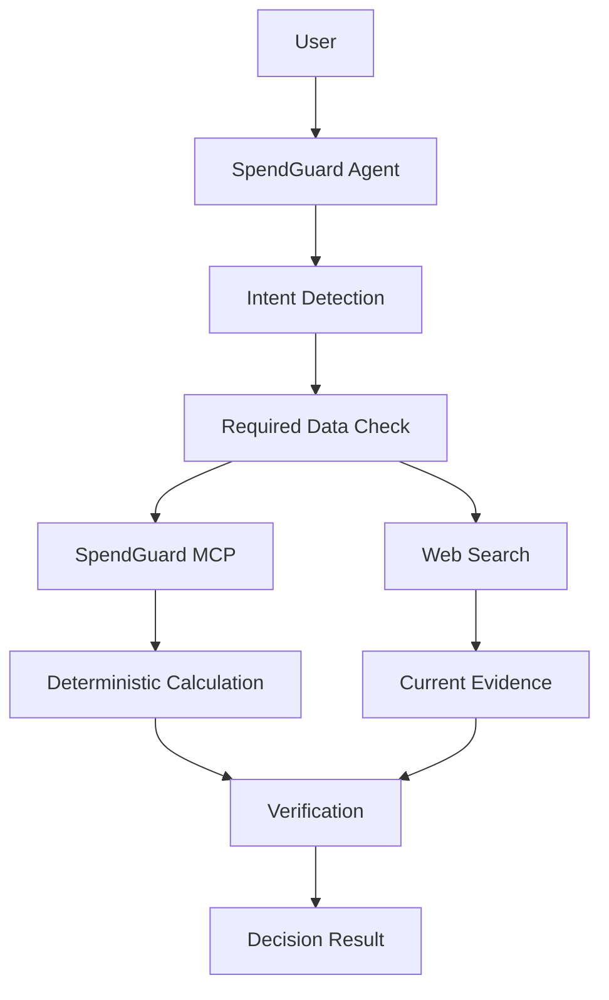

# SpendGuard 프로젝트 기획서

> 구매·구독·계약·생활비와 관련된 질문을 분석하고, 최신 자료·정확한 계산·사용자 조건을 근거로 비용 의사결정을 지원하는 MCP 기반 AI Agent

## 1. 프로젝트 목적

사용자의 소비 관련 질문을 자연어로 입력받고, 필요한 정보 확인·결정론적 계산·최신 정보 조사·선택지 비교를 거쳐 검증 가능한 판단 근거를 제공한다.

단순 프롬프트 모음이나 자유 형식 상담 서비스가 아니라, Tool과 MCP를 사용한 재현 가능한 의사결정 workflow 구현을 목표로 한다.

## 2. 핵심 원칙

- 결론 우선
- 사실과 추정 분리
- 변동 정보 최신 확인
- 사용자 의견에 대한 무조건적 동의 금지
- 선택지 비교
- 필수 데이터 누락 확인
- 숫자 기반 설명
- 사용자 조건 우선
- 잘못된 전제 수정
- 최종 결과 검증
- 계산 로직과 LLM 역할 분리
- 현재 Phase 범위 준수

## 3. 처리 흐름

## 4. 역할 분리

### Agent

- 질문 의미 분석
- Intent 분류
- 필요한 정보 판단
- 검색 질의 생성
- Tool 선택
- 결과 해석
- 선택지 비교
- 최종 설명 생성

### Tool / MCP

- 할부 계산
- 대출 변경 계산
- 사용당 비용 계산
- TCO 계산
- 연간 비용 계산
- 비용 비교
- 반복 지출 정규화

### Web Search

- 현재 가격
- 현재 상품 조건
- 현재 요금제
- 공식 정책
- 프로모션
- 제품 사양

## 5. Decision Pack

| Pack | 처리 대상 |
| --- | --- |
| Purchase | 제품 구매, 중고, 대체재, 구매 시점 |
| Recurring Cost | 구독, 통신비, 반복 지출 |
| Finance Cost | 할부, 대출 변경 |
| Ownership Cost | 자동차 등 장기 보유 비용 |
| Quote Audit | 견적서, 계약 비용 |
| Budget Optimization | 장보기, 여행, 최근 지출 |

## 6. 초기 MCP Tool 후보

- `calculate_installment`
- `calculate_refinance`
- `calculate_usage_cost`
- `calculate_tco`
- `annualize_expense`
- `compare_costs`
- `analyze_recurring_cost`
- `normalize_expense`

MCP Server는 결정론적 기능만 담당한다.

LLM 호출, Web Search, Agent orchestration은 MCP Server 범위에 포함하지 않는다.

## 7. 기술 스택

| 구분 | 기술 |
| --- | --- |
| Language | Python 3.13 |
| API | FastAPI |
| Agent | OpenAI Agents SDK |
| LLM API | OpenAI Responses API |
| MCP | FastMCP |
| HTTP | HTTPX |
| Validation | Pydantic |
| Test | pytest |
| Frontend | HTML / CSS / JavaScript |
| MCP Transport | stdio 우선 |

## 8. 데이터 정책

초기 버전에서 사용자 금융 계정과 직접 연결하지 않는다.

저장하지 않는 정보:

- 카드번호
- 계좌번호
- 주민등록번호
- 인증 정보
- 금융회사 로그인 정보

초기 구현은 현재 세션에서 필요한 입력만 처리한다.

## 9. 출력 구조

최종 결과는 최소한 아래 항목을 구분한다.

- 결론
- 사실
- 가정
- 계산
- 선택지
- 위험
- 실행 항목
- 출처

## 10. Phase

### Phase 0. Repository Bootstrap

- 문서 구조 정리
- Git 초기화
- Codex 공통 규칙 정리
- Skill workflow 구성

### Phase 1. Core Agent

- 자연어 입력
- Intent 분류
- 필수 정보 확인
- Structured Output
- 기본 Web UI

### Phase 2. Calculation Tools

- 할부 계산
- 대출 변경 계산
- 연간 지출 계산
- 사용당 비용 계산
- TCO 계산
- 비용 비교

### Phase 3. MCP Server

- Calculation Tool MCP 분리
- 독립 MCP Client 호출
- Agent MCP 호출
- Function Tool과 MCP Tool 결과 비교

### Phase 4. Current Information Research

- Web Search
- 출처 수집
- 조회 시각 기록
- 공식 출처 우선 처리

### Phase 5. Decision Packs

- Purchase
- Recurring Cost
- Finance Cost
- Ownership Cost
- Quote Audit
- Budget Optimization

### Phase 6. Evaluation

- 계산 정확도
- 필수 입력 검증
- 계산식 표시
- 외부 사실 출처 확인
- 근거 없는 수치 확인
- Tool 오류 처리 확인

## 11. 초기 평가 기준

| 지표 | 기준 |
| --- | ---: |
| 계산 정확도 | 100% |
| 필수 입력값 검증 | 100% |
| 계산식 표시 | 100% |
| 외부 사실 출처 포함 | 100% |
| 근거 없는 수치 | 0건 |
| Tool 오류 미처리 | 0건 |

## 12. 범위 제외

초기 프로젝트에서 구현하지 않는다.

- 자동 구매
- 자동 계약
- 자동 구독 해지
- 은행 계좌 연동
- 카드사 계정 연동
- 신용평가
- 투자 자문
- 보험 가입 결정
- 대출 상품 가입 결정
- 브라우저 자동 결제
- 가격 변동 예측 모델
- 사용자 소비 데이터를 이용한 광고

## 13. 프로젝트 성공 기준

- 자연어 소비 질문 처리
- 질문 유형 자동 분류
- 필수 정보 누락 감지
- 결정론적 계산
- MCP Tool 호출
- 최신 데이터 조사
- 선택지 비교
- 근거 표시
- 동일 입력의 계산 결과 재현 가능
- Tool 호출과 결과 검증 가능
