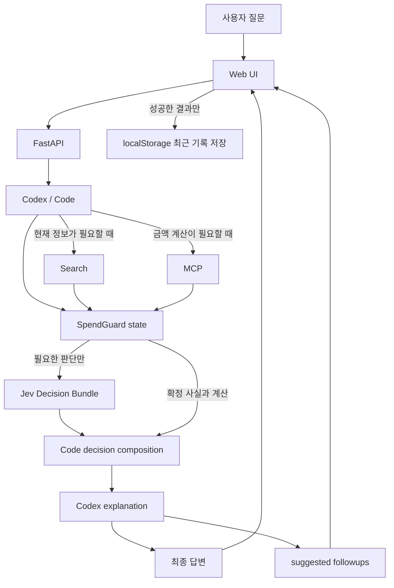
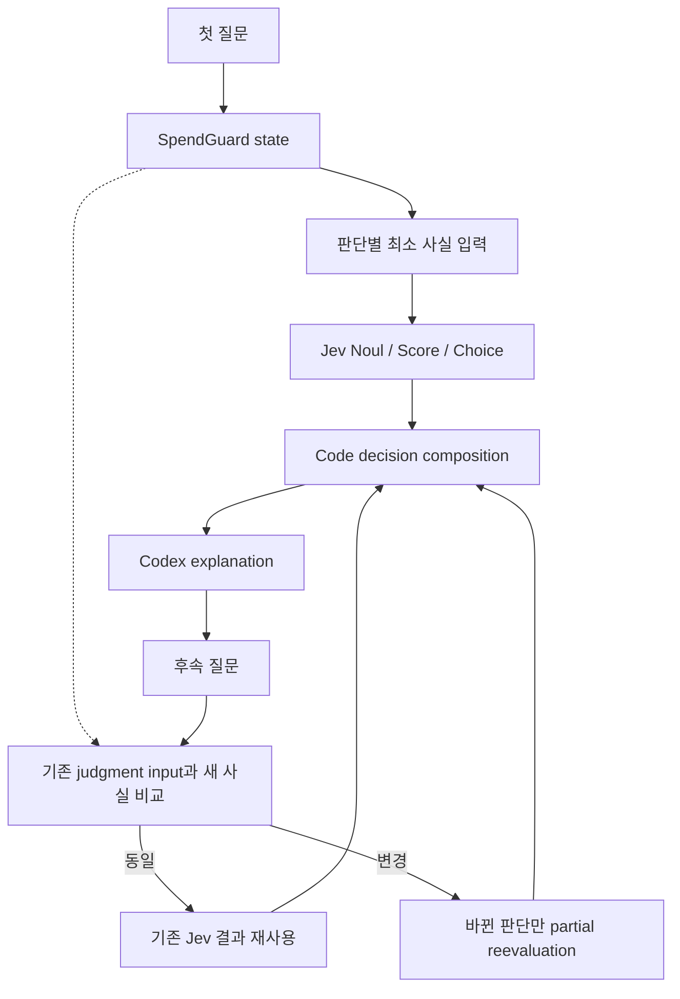
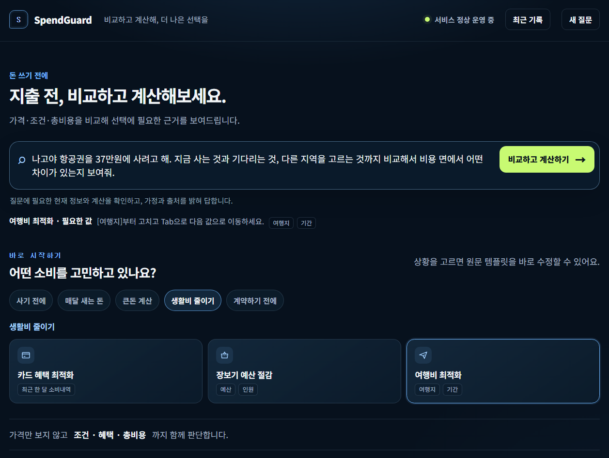
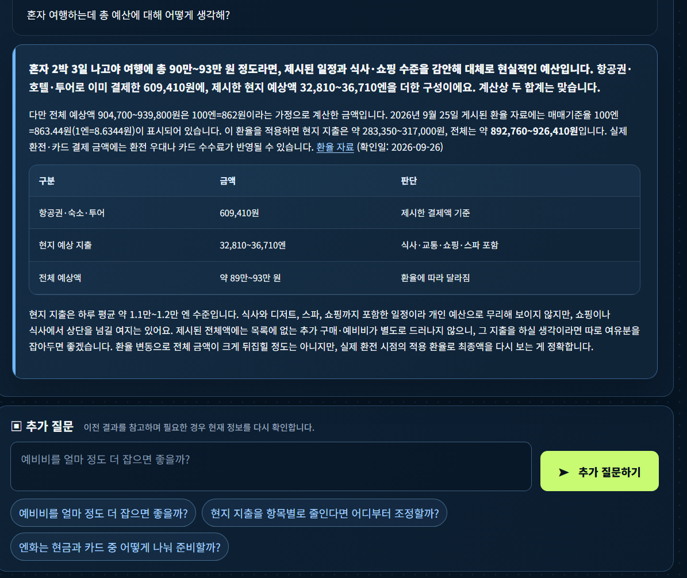
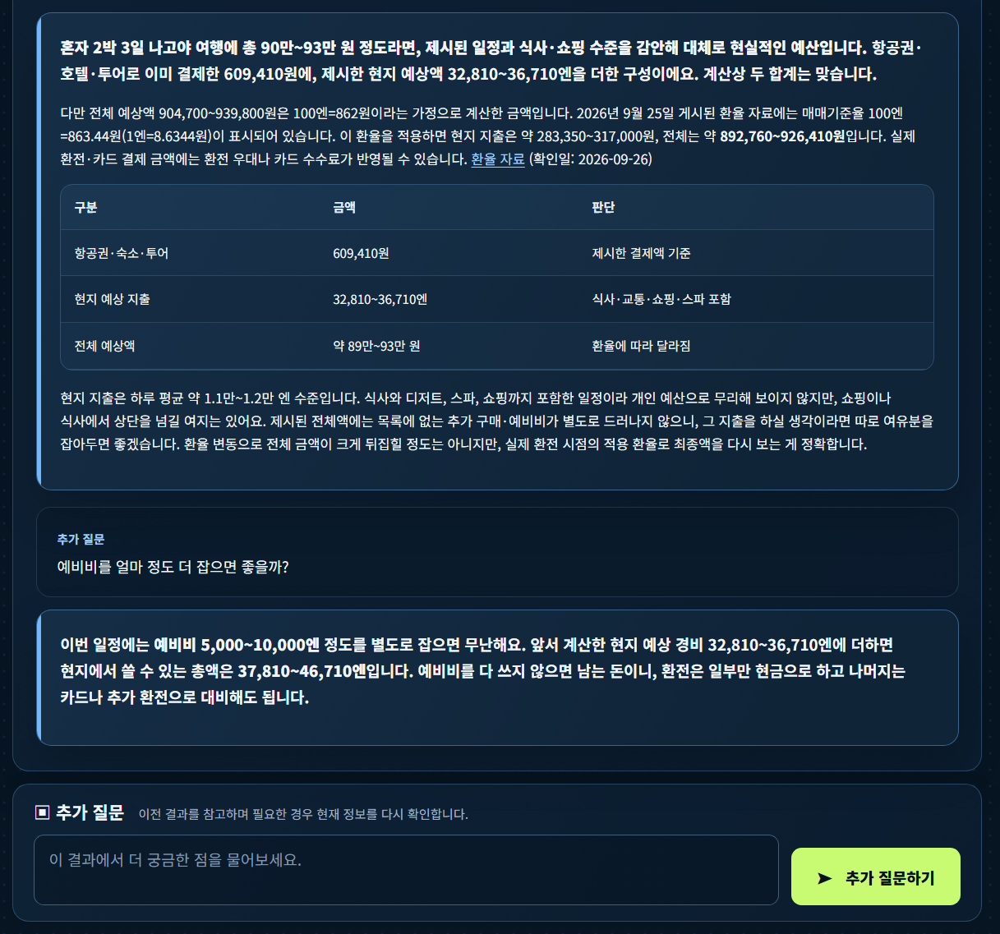

# SpendGuard

> 15개의 소비 문제를 실제 질문으로 해결하고, Codex·Search·MCP·Jev를 역할별로 분리해 검증하는 소비 절감형 웹 애플리케이션

## 개요

SpendGuard는 구매·구독·계약·생활비처럼 자주 발생하는 소비 문제를 실제 질문 단위로 해결하는 프로젝트입니다.

사용자가 모든 조건을 완성해서 입력하지 않아도 현재 정보, 합리적인 가정, 검색 결과, 결정론적 계산을 조합해 가능한 범위까지 한 번에 답합니다.

### 전체 런타임 흐름



현재 웹 요청에서는 Codex가 필요한 Search·MCP 실행과 최종 설명을 담당합니다. Jev는 판단 가능한 작은 semantic judgment만 수행하고, FastAPI가 결과를 세션 state에 저장합니다.

### Jev 판단과 후속 질문



후속 질문의 명시적인 금액 사실은 FastAPI가 먼저 비교합니다. 입력이 같은 판단은 재사용하고, 변경된 판단만 다시 평가합니다.

### 화면 미리보기

| 질문 입력 | 분석 진행 |
| --- | --- |
|  |  |
| 상황별 질문 템플릿에서 여행비 비교를 시작합니다. | 분석 중 경과 시간과 중단 동작을 확인할 수 있습니다. |

| 첫 결과와 추천 질문 | 후속 답변 |
| --- | --- |
|  |  |
| 근거와 계산을 표로 보고, 추천 질문을 입력에 활용합니다. | 이전 결과를 참고해 새 조건을 반영한 답변을 확인합니다. |

브라우저 localStorage 기반 최근 소비 판단 기록 저장 및 다시 보기를 지원합니다.

현재 사용자 요청 경로에서는 OpenAI Platform API를 직접 사용하지 않습니다.

- 기존 Codex CLI의 ChatGPT 계정 인증 상태 재사용
- `OPENAI_API_KEY`, `OPENAI_MODEL` 불필요
- OpenAI Responses API 직접 호출 없음
- OpenAI Agents SDK 사용자 요청 처리 없음
- SpendGuard 실행 중 자동 로그인·OAuth·브라우저 인증 없음

### 사용 조건

SpendGuard는 로컬 실행을 기본으로 합니다.

필수:
- Python 3.13
- Codex CLI
- ChatGPT 계정으로 로그인된 Codex 환경

Jev Decision Layer 사용 시:
- TypeSafe Jev API key

OpenAI Platform API key는 필요하지 않습니다.

사용자는 자신의 Codex 인증과 사용 한도를 사용합니다.
SpendGuard는 실행 중 Codex 로그인이나 OAuth를 대신 수행하지 않습니다.

TypeSafe Jev API key가 없으면 baseline 실행 경로는 사용할 수 있습니다.
현재 Web UI의 기본 제품 경로는 Jev 모드를 사용하므로,
전체 UI 기능을 그대로 사용하려면 TypeSafe Jev API key가 필요합니다.

---

## 돈 아껴주는 15개 시나리오

| No. | 시나리오 | 핵심 결과 |
| --- | --- | --- |
| 1 | 최저가 비교 | 현재 가격, 대안, 조건, 실제 차액 |
| 2 | 구독료 다이어트 | 월·연 비용, 중복·저활용 후보, 절감액 |
| 3 | 통신비 점검 | 현재 비용, 대안 요금제, 월·연 차액 |
| 4 | 보험 중복 찾기 | 보험료, 중복 가능 보장, 확인 필요 항목 |
| 5 | 카드 혜택 최적화 | 혜택, 조건, 연회비 반영 순혜택 |
| 6 | 충동구매 방지 | 사용당 비용, 대체재, 기회비용 |
| 7 | 장보기 예산 절감 | 식단, 장보기 목록, 총액, 예산 잔액 |
| 8 | 여행비 최적화 | 주요 비용, 대안 조합, 총비용 차이 |
| 9 | 자동차 유지비 계산 | 항목별 비용, 5년 TCO, 월평균 |
| 10 | 할부 vs 일시불 | 월 납부액, 총이자, 총비용, 차액 |
| 11 | 대출 갈아타기 계산 | 기존·신규 총이자, 수수료, 순절감액 |
| 12 | 견적서 바가지 체크 | 합계, 공개 가격 비교, 검토·협상 후보 |
| 13 | 가격 협상 준비 | 비교 근거, 협상 항목, 실제 협상 문장 |
| 14 | 연간 새는 돈 찾기 | 반복 지출 연환산, 절감 후보, 연간 절약액 |
| 15 | 구매 전 최종 심사 | 지금 구매·대기·중고·대체품 비용 비교 |

15개는 제품 기능 목록입니다.

시나리오별 독립 pipeline이나 복잡한 공통 answer schema로 확장하지 않습니다.

---

## 핵심 구성

### Codex / Code

Codex와 Code는 사용자 질문을 해석하고 Jev가 판단할 수 있는 상태를 만듭니다.

- 사용자 사실 추출
- 수정 가능한 가정 구성
- Search / MCP 사용 판단
- Search / MCP 실행
- SpendGuard state 구성
- Jev 판단 결과와 확정 계산값 조합
- 최종 사용자 답변 작성

SpendGuard 사용자 요청의 Codex 실행은 기본적으로 `gpt-6-luna`와 low reasoning을 사용합니다.

이 설정은 SpendGuard 프로세스에만 적용하며 개발용 Codex 설정은 변경하지 않습니다.

후속 질문은 서버가 보관한 Codex 세션을 `exec resume`으로 이어가며, 기존 근거로 먼저 답하고 새로운 현재 정보가 필요한 경우에만 Search를 다시 사용합니다.

Codex 사용 한도 오류는 HTTP 429와 `codex_usage_limit` 코드로 처리합니다.

### Search

현재 정보가 필요한 경우에만 사용합니다.

- 현재 가격
- 요금제
- 카드 혜택
- 항공권·숙박
- 판매·예약 조건
- 공개 견적·시세
- 제품 사양
- 공식 정책

검색하지 않은 최신 정보를 생성하지 않고, 값·조건·출처·확인 시점을 실제 비교에 사용합니다.

한 요청의 live Search는 최대 4회 또는 Search 시작 후 60초로 제한합니다.

필요한 근거가 먼저 확보되면 즉시 답변하고, 상한에 도달하면 현재 근거와 불확실성을 바탕으로 마무리합니다.

### MCP / Calculation

재현 가능한 계산은 FastMCP 도구로 처리합니다.

- `calculate_installment`
- `calculate_refinance`
- `calculate_usage_cost`
- `annualize_expense`
- `calculate_tco`
- `compare_costs`
- `calculate_repeated_cost`
- `sum_costs`

계산 결과는 SpendGuard state의 확정값으로 사용하며 Codex나 Jev가 임의로 다시 계산하지 않습니다.

### SpendGuard state

Jev 호출 전에 사용자 사실·검색 결과·계산 결과를 하나의 내부 상태로 구성합니다.

```text
SpendGuard state
├─ user_facts
├─ assumptions
├─ current_facts
├─ alternatives
├─ calculations
├─ judgment_facts
├─ jev_results
└─ sources
```

이 state는 사용자에게 노출하는 결과 schema가 아니라 Codex·Code·Jev가 같은 근거를 공유하기 위한 내부 판단 입력입니다.

---

## Jev Decision Layer

Jev는 전체 workflow를 통과시키는 gate나 scenario router가 아닙니다.

계산이나 사실 조회로 확정할 수 없는 **작은 semantic judgment를 여러 개 묶어 빠르게 판단하는 decision layer**로 사용합니다.

### Jev primitive

- `Noul` — yes/no 성격의 판단
- `Score` — 필요도·부담·가치·중복도 같은 정도 평가
- `Choice` — 코드에서 미리 정의한 선택지 중 하나 선택

Jev가 가격, 계산값, 새로운 제품 선택지를 임의로 생성하게 하지 않습니다.

### 구매 판단 Decision Bundle

구매·교체 질문에서는 한 번의 Jev 요청으로 여러 판단을 묶어 수행합니다.

```text
Codex / Code
→ 사용자 사실 추출
→ 필요한 현재 가격 Search
→ MCP 계산
→ SpendGuard state 구성

Jev 한 번 호출
├─ Noul: 지금 교체 필요성이 충분한가?
├─ Noul: 현재 구매가 생활비 여유를 훼손하는가?
├─ Noul: 구매를 미뤄도 사용상 손실이 작은가?
├─ Score: 현재 기기의 교체 필요도
├─ Score: 구매 부담 수준
├─ Score: 기존 제품 대비 업그레이드 가치
├─ Choice: buy_now / wait / buy_cheaper_variant
└─ Choice: 가장 중요한 판단 요인
       price / replacement_need / feature_gain / cashflow

→ Code가 결정 조합
→ Codex는 설명 작성
```

Codex는 Jev가 이미 수행한 동일 semantic judgment를 다시 처음부터 반복하지 않도록 합니다.

### 재사용 가능한 판단

Jev는 시나리오보다 **판단 종류**를 기준으로 재사용합니다.

현재는 구매·교체 Decision Bundle을 구현했습니다. 나머지 판단은 동일한 구조로 확장할 후보이며 아직 구현 완료 범위에 포함하지 않습니다.

| 판단 | Primitive | 활용 |
| --- | --- | --- |
| 지출 필요성이 높은가 | Score / Noul | 충동구매, 구매 전 최종 심사 |
| 현재 현금흐름 부담이 큰가 | Score / Noul | 구매, 여행, 구독, 카드 |
| 미뤄도 손실이 작은가 | Noul | 구매, 교체, 계약 |
| 대체 가능성이 높은가 | Score | 구매, 구독, 장보기 |
| 가격 대비 효용이 높은가 | Score | 구매, 카드, 통신 |
| 기존 대비 업그레이드 가치가 높은가 | Score | 제품 교체 |
| 기능 중복도가 높은가 | Score | 구독, 보험 |
| 저활용 상태인가 | Noul / Score | 구독, 반복 지출 |
| 만족도 손실이 낮은 절감인가 | Score / Noul | 연간 새는 돈, 장보기 |
| 추가 검토가 필요한 항목인가 | Noul | 견적 |
| 어느 대안이 더 적합한가 | Choice | 구매, 여행, 카드 |
| 가장 중요한 결정 요인은 무엇인가 | Choice | 구매, 계약, 비교 |

Jev가 맡지 않는 역할:

- 현재 가격 검색
- 사실 검증
- 금액·이자·단위 계산
- 전체 scenario routing
- 자동 결제·계약·해지
- 최종 자연어 답변 작성

---

## Baseline / Jev 비교

제품에서 Jev를 실제로 활용하되, 효과를 검증하기 위해 baseline을 유지합니다.

```text
baseline
= Codex + Search + MCP
  → Codex가 semantic judgment와 설명을 모두 수행

jev
= Codex / Code + Search + MCP
  → SpendGuard state
  → Jev Decision Bundle
  → Code decision composition
  → Codex explanation
```

비교의 핵심은 Jev 호출 자체가 아니라 **Codex가 수행하던 semantic judgment를 Jev가 실제로 대체하는지**입니다.

측정:

- scenario success
- 최종 답변 품질
- Jev judgment 정확도
- Jev abstain / unknown
- Codex 실행 횟수
- Jev 요청 횟수
- Search / MCP 사용 횟수
- E2E latency
- failure / timeout / retry

측정할 수 없는 ChatGPT 내부 token, model cost, Web Chat quota는 추정하지 않습니다.

Jev 적용 기준:

- judgment 품질이 사전 정의 기준 충족
- 최종 답변 품질 저하 없음
- Codex가 동일 judgment를 반복하지 않음
- Codex 실행량 또는 E2E latency 개선
- failure / retry 증가 없음

---

## 검증

### 제품 검증

실제 `/api/decisions` 경로로 확인합니다.

```text
일반 추론
Search
MCP
Search + MCP
Jev Decision Bundle
후속 질문
사용 한도 오류 처리
사용자 결과 렌더링
```

원칙:

- 이미 제공한 값 재질문 금지
- 선택 정보 부족만으로 흐름 중단 금지
- 근거 없는 숫자·가격·조건 생성 금지
- Search / MCP 결과의 최종 답변 반영 확인
- 실패를 기록만 하고 종료하지 않고 공통 원인을 수정 후 재검증
- 실행하지 않은 테스트나 측정값 기록 금지

### Jev 검증

기존 `chapter_b_sparse_v1`은 사용자 UX와 전체 답변 검증에 유지합니다.

Jev 자체 평가는 판단에 필요한 정보가 포함된 fixture를 별도로 사용합니다.

```text
동일 user facts
동일 Search facts
동일 MCP results
동일 alternatives
→ baseline
vs
→ Jev Decision Bundle
```

Jev에 유리하도록 Search나 계산 결과를 다르게 주지 않습니다.

---

## 현재 구현 상태

- Web UI → FastAPI → Codex CLI 사용자 요청 경로
- OpenAI Platform API 없는 사용자 요청 처리
- 기존 Codex CLI 인증 재사용
- `gpt-6-luna` + low reasoning runtime
- Search 최대 4회 / 60초 budget
- FastMCP 기반 결정론적 계산
- Codex session resume 기반 후속 질문
- Codex usage limit 429 처리
- 진행 단계·경과 시간·Search/MCP 호출 수 표시
- 분석 중단 시 서버 Codex 작업 취소
- 320px / 390px 모바일 가로 넘침 검증
- pytest / E2E 검증

현재 다음 작업은 Jev를 단일 후보 필터가 아니라 **실제 Decision Bundle**로 재구성하는 것입니다.

---

## 기술 구성

| 구분 | 기술 |
| --- | --- |
| Language | Python 3.13 |
| API | FastAPI |
| Runtime reasoning | Codex CLI authenticated with ChatGPT account |
| Current information | Codex Search |
| Calculation | FastMCP 4.0.0 |
| Decision layer | TypeSafe Jev |
| Validation | Pydantic |
| Test | pytest / E2E |
| Frontend | HTML / CSS / JavaScript |

---

## 실행

Python 3.13과 `uv`를 사용합니다.

```powershell
uv sync --all-groups
uv run uvicorn spendguard.main:app --reload
```

브라우저:

```text
http://127.0.0.1:8000
```

현재 사용자 요청 경로에는 `OPENAI_API_KEY`, `OPENAI_MODEL`이 필요하지 않습니다.

Jev를 사용하는 경우 TypeSafe 설정이 별도로 필요합니다.

---

## 기존 이력

Phase 0~7, Chapter A, Track A 결과는 historical result로 보존합니다.

과거 OpenAI Agents SDK / Responses API 기반 측정은 당시 실제 구현 결과이며 현재 Codex runtime 결과와 구분합니다.

Track A에서 확인된 실패를 반복하지 않습니다.

- broad Intent router로 Jev 사용하지 않음
- 추가 정보 필요 여부를 Jev에 맡기지 않음
- Search 필요 여부를 Jev에 맡기지 않음
- Jev 호출 때문에 Codex 실행 횟수를 늘리지 않음
- 질문 전체를 근거 없이 한 번 분류해 `unknown`만 만드는 구조를 기본 Jev 활용으로 사용하지 않음

---

## 범위

SpendGuard는 비교·계산·정보 정리와 소비 판단을 중심으로 합니다.

제품 범위에서 제외하는 기능:

- 자동 구매
- 자동 결제
- 자동 계약
- 자동 구독 해지
- 은행·카드 계정 직접 연동
- 투자 자문
- 보험 상품 가입 결정
- 대출 상품 가입 결정

보험·대출 영역은 비용 비교와 정보 정리에 한정합니다.

---

## 프로젝트 구조

```text
spendguard-agent/
├── .agents/
├── .project/
├── docs/
│   ├── instructions/
│   └── results/
├── evals/
├── scripts/
├── src/
├── tests/
├── AGENTS.md
├── DESIGN.md
├── README.md
├── pyproject.toml
└── uv.lock
```

## 문서

| 문서 | 역할 |
| --- | --- |
| `.project/plan.md` | 프로젝트 전체 기획 기준 |
| `AGENTS.md` | 저장소 공통 작업 규칙 |
| `DESIGN.md` | Web UI 디자인 기준 |
| `docs/instructions/*` | 작업 범위와 완료 기준 |
| `docs/results/*` | 실제 구현·검증 결과 |
