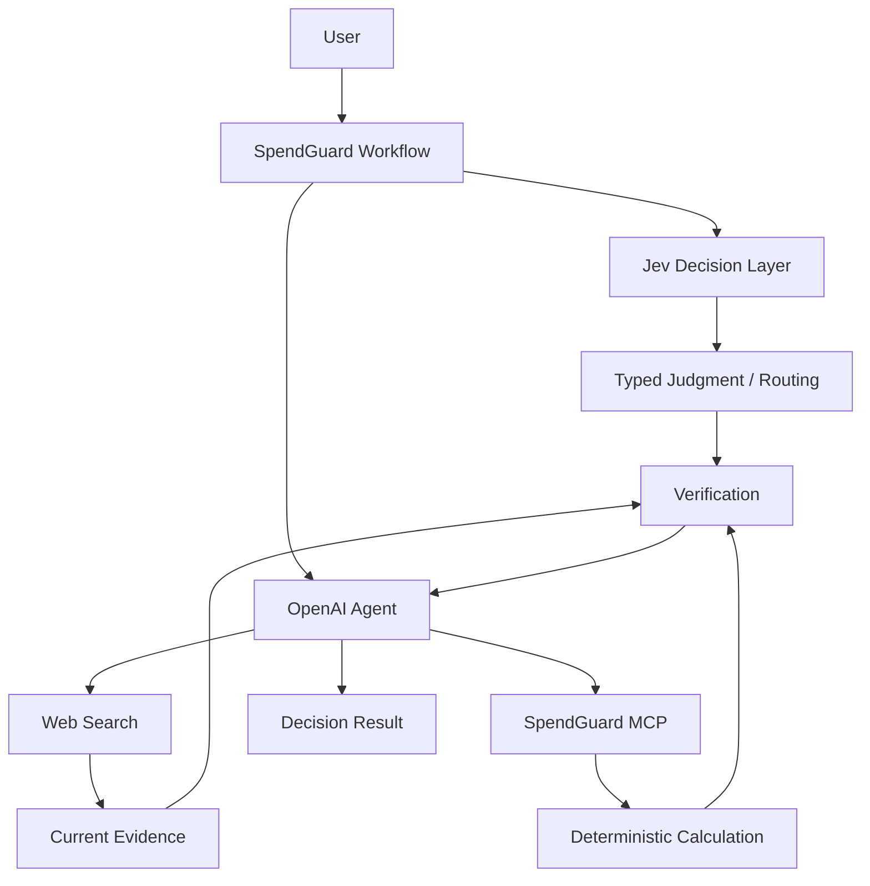

# SpendGuard

> Jev, OpenAI Agent, MCP를 활용해 구매·구독·비용 의사결정을 계산·비교·검증하는 프로젝트

## 개요

SpendGuard는 구매·구독·계약·생활비와 관련된 자연어 질문을 분석하고, 필요한 정보 확인, 의미 판단, 결정론적 계산, 최신 정보 조사, 선택지 비교를 거쳐 검증 가능한 판단 근거를 제공하는 AI 의사결정 지원 프로젝트입니다.

역할을 분리합니다.

- Jev: 좁고 닫힌 선택지의 typed judgment 평가 및 향후 routing 후보
- OpenAI Agent: 복합 추론, Tool orchestration, 사용자용 설명
- MCP / Code: 계산, 정규화, 비교 같은 결정론적 처리
- Web Search: 가격·정책·요금제처럼 변동 가능한 외부 사실 확인

Jev는 Phase 2에서 Phase 1 OpenAI baseline과 비교 평가한 뒤 적용 범위를 결정합니다.

## 해결하려는 문제

- 소비 관련 질문에서 필요한 조건 누락
- 할부·대출·TCO·연간 절감액 계산 오류 가능성
- 가격·요금제·정책 등 변동 정보의 최신성 문제
- 근거 없는 추천
- 사실·가정·계산·모델 판단의 혼합
- 모든 판단을 하나의 생성형 모델에 맡기는 구조

## 핵심 구조



현재 Phase 7까지 완료된 상태입니다.

구현 완료:

- OpenAI Agent baseline
- Jev `Choice` Intent 평가
- 결정론적 Calculation Tool 6종
- FastMCP stdio Server / Client
- Decision Workspace UI
- Web Search 기반 최신 정보 조사
- Researching 상태 및 Sources UI
- Decision Pack workflow 6종
- End-to-End 고정 평가 및 회귀 검증

미구현:

- Jev production routing

## 계획 Decision Pack

후속 Phase 구현 계획.

| Pack | 처리 대상 |
| --- | --- |
| Purchase | 제품 구매, 중고, 대체재, 구매 시점 |
| Recurring Cost | 구독, 통신비, 반복 지출 |
| Finance Cost | 할부, 대출 변경 |
| Ownership Cost | 자동차 등 장기 보유 비용 |
| Quote Audit | 견적서, 계약 비용 |
| Budget Optimization | 장보기, 여행, 최근 지출 |

## 개발 단계

| Phase | 범위 | 상태 |
| --- | --- | --- |
| Phase 0 | Repository Bootstrap | 완료 |
| Phase 1 | Core Agent Baseline | 완료 |
| Phase 2 | Jev Decision Layer Evaluation | 완료 |
| Phase 3 | Calculation Tools | 완료 |
| Phase 4 | MCP Server | 완료 |
| Phase 4.5 | Decision Workspace UI | 완료 |
| Phase 5 | Current Information Research | 완료 |
| Phase 6 | Decision Packs | 완료 |
| Phase 7 | End-to-End Evaluation | 완료 |

## 전체 흐름
```
Agent baseline
→ Jev 판단 비교
→ 결정론적 계산
→ MCP 연결
→ 실제 화면 구성
→ 최신 정보 조사
→ Decision Pack 확장
→ 전체 평가
```

## Phase 1 검증 결과

OpenAI 기반 baseline을 고정 평가 데이터 17건으로 검증했습니다.

| 항목 | 결과 |
| --- | --- |
| 평가 케이스 | 17 |
| Intent 정답 | 16 |
| Intent 정확도 | 94.12% |
| API 오류 | 0 |
| pytest | 10 passed |

실패 케이스는 `ambiguous-001`이며, expected intent는 `unknown`, actual intent는 `budget_optimization`입니다. 상세 구현 및 평가 결과는 [Phase 1 결과 문서](docs/results/phase1-core-agent.md)를 참조하세요.

## Phase 2 검증 결과

동일 고정 평가 데이터 17건 기반 Jev `Choice` Intent 분류 검증. Jev production routing과 confidence threshold 미적용 상태.

| 항목 | 결과 |
| --- | --- |
| Intent 정답 | 16 |
| Intent 정확도 | 94.12% |
| 평균 지연 시간 | 259.25ms |
| p50 지연 시간 | 238.50ms |
| API 오류 | 0 |
| Usage | Input 8,981 / Output 1,319 |
| 비용 | 계산 기준 $0.000377202 / Dashboard $0.0004 |

실패 케이스는 `ambiguous-001`이며, expected intent는 `unknown`, actual intent는 `budget_optimization`입니다. 상세 비교와 usage 비용은 [Phase 2 결과 문서](docs/results/phase2-jev-decision-layer.md)를 참조하세요.

## Phase 3 검증 결과

결정론적 비용 계산 Tool 6종 구현. 외부 API와 모델 호출 없는 로컬 계산.

| 항목 | 결과 |
| --- | --- |
| Calculation Tool | 할부, 대환, 사용당 비용, 연간 환산, TCO, 비용 비교 |
| 반올림 | `Decimal`, 소수점 둘째 자리, `ROUND_HALF_UP` |
| 전체 pytest | 26 passed |

계산식, 중간값, 입력, 결과의 추적 가능 구조. 상세 내용은 [Phase 3 결과 문서](docs/results/phase3-calculation-tools.md)를 참조하세요.

## Phase 4 검증 결과

FastMCP 4.0.0 기반 stdio MCP Server와 독립 MCP Client 구현. Phase 3 Calculation Tool 6종 재사용.

| 항목 | 결과 |
| --- | --- |
| MCP Tool | 할부, 대환, 사용당 비용, 연간 환산, TCO, 비용 비교 |
| Transport | stdio |
| Direct / MCP 결과 | 입력, 계산식, 중간값, 결과 일치 |
| 전체 pytest | 35 passed |

입력·출력 schema 검증과 오류 전달 검증. 상세 내용은 [Phase 4 결과 문서](docs/results/phase4-mcp-server.md)를 참조하세요.

## Phase 4.5 검증 결과

기존 Agent 분석, Calculation Tool, stdio MCP 결과 연결 기반 Decision Workspace 구현.

| 항목 | 결과 |
| --- | --- |
| 화면 | Header, 실제 기능 Navigation, Ask, Decision 상태, 결과 Card, Inspector |
| 실제 연결 | OpenAI Agent, Direct Calculation, stdio MCP Calculation |
| Decision 상태 | Needs Input, Calculating, Review, Ready |
| 반응형 | Desktop 1440px, Mobile 500px 검증 |
| 전체 pytest | 41 passed |

Phase 4.5 완료 시점에는 Web Search, Researching, Decision Pack workflow를 구현하거나 노출하지 않았습니다. 상세 내용은 [Phase 4.5 결과 문서](docs/results/phase4.5-decision-workspace-ui.md)를 참조하세요.

## Phase 5 검증 결과

OpenAI Agents SDK `WebSearchTool`로 가격·요금제·정책·프로모션·사양·판매 조건처럼 변동 가능한 외부 사실만 조사합니다. 사용자 제공 값과 결정론적 계산은 검색하지 않습니다.

| 항목 | 결과 |
| --- | --- |
| 출처 추적 | `value`, `source_name`, `source_url`, `retrieved_at` |
| 공식 출처 | Agent가 공식 URL을 우선 선택하고 실제 Responses citation/source URL과 교차 검증 |
| 오류/불확실성 | 검색 결과 없음, 공식 출처 미확인, 상충 정보, 최신성 확인 불가, Tool 오류 처리 |
| Workspace | 실제 research 요청에서만 `Researching`, Sources에 링크·조회 시각 표시 |
| 실제 외부 호출 | 공식 Apple Korea query로 Web Search 호출 및 source URL/retrieved_at 확인 |

Phase 6 Decision Pack workflow는 포함하지 않습니다. 상세 내용은 [Phase 5 결과 문서](docs/results/phase5-current-information-research.md)를 참조하세요.

## Phase 6 검증 결과

6개 Decision Pack은 Agent의 structured intent를 코드 정책으로 Pack에 연결하고, Pack별 필수 입력을 확인한 뒤 필요한 경우 기존 stdio MCP Calculation Tool과 Phase 5 Web Search 결과를 재사용합니다. Jev는 Phase 2 평가 결과 때문에 production routing에 사용하지 않습니다.

| 항목 | 결과 |
| --- | --- |
| Decision Pack | Purchase, Recurring Cost, Finance Cost, Ownership Cost, Quote Audit, Budget Optimization |
| 필수 입력 | 코드 소유 Required Data 검사 및 `needs_input` fallback |
| 계산 | 기존 MCP 6개 Tool 재사용, Tool 오류 시 확정 결론 생성 안 함 |
| 외부 사실 | Phase 5 source 구조를 Sources와 Decision Result에 분리 표시 |
| Workspace | 공통 Decision Pack form 및 데이터 기반 결과 Card |
| 초기 절약 시나리오 | 15종 모두 Intent·필수 입력·검색·계산 조건으로 coverage 검증 |

자동 구매·계약·구독 해지, 금융 계정 연동, 가격 예측은 포함하지 않습니다. 상세 내용은 [Phase 6 결과 문서](docs/results/phase6-decision-packs.md)를 참조하세요.

## Phase 7 검증 결과

`phase7-v1` 고정 평가 데이터 21건(Decision Pack workflow 20건, Web Search 오류 API 1건)을 첫 실행 전에 고정해 평가했습니다. 기존 `ambiguous-001`과 expected intent는 유지했습니다.

| 항목 | 결과 |
| --- | --- |
| Code-owned Pack routing | 20 / 20 (100%) — 고정 structured output 이후 workflow routing |
| Calculation Accuracy | 9 / 9 (100%), 기존 6개 Tool의 Direct/MCP 결과 일치 |
| Required Data Accuracy | 20 / 20 (100%) |
| Source Coverage / Unsupported Fact | 1 / 1 trace (100%) / 0건 |
| 오류 처리 | MCP 오류 1 / 1 `tool_error`, Web Search 오류 API 502 |
| End-to-End Success | 20 / 20 (100%) |
| 실제 외부 호출 | OpenAI Web Search + MCP 1회, 공식 Apple URL·retrieved_at 확인 |

Jev는 production routing에 사용하지 않습니다. Phase 2의 Jev 17-case 실측(16 / 17, `ambiguous-001` confidence 0.99 오분류)과 위 workflow 평가를 같은 모델 정확도로 합산하지 않았습니다. OpenAI Agent 결과 경계에서 usage와 정확한 Web Search tool-call 수가 확인되지 않아 Phase 7 비용을 추정하지 않았습니다. 상세 내용은 [Phase 7 결과 문서](docs/results/phase7-end-to-end-evaluation.md)를 참조하세요.

## 기술 구성

| 구분 | 기술 |
| --- | --- |
| Language | Python 3.13 |
| API | FastAPI |
| Agent | OpenAI Agents SDK |
| LLM API | OpenAI Responses API |
| Decision Model Evaluation | TypeSafe Jev (`typesafe-sdk`) |
| MCP | FastMCP 4.0.0 |
| Validation | Pydantic |
| Test | pytest |
| Frontend | HTML / CSS / JavaScript |

후속 Phase 계획:

| 구분 | 기술 |
| --- | --- |
| HTTP | HTTPX |

## 실행

Python 3.13과 uv가 필요합니다.

```powershell
uv sync --all-groups
uv run uvicorn spendguard.main:app --reload
```

프로젝트 루트 `.env`에 다음 변수를 설정합니다.

```text
OPENAI_API_KEY=
OPENAI_MODEL=
TYPESAFE_API_KEY=
```

브라우저에서 `http://127.0.0.1:8000`을 엽니다. API 키 또는 모델 설정이 없으면 `/api/analyze`는 설정 오류를 `503`으로 반환합니다.

## 검증

```powershell
uv run pytest
uv run python scripts/evaluate_phase1.py
```

평가 스크립트는 `evals/phase1_cases.json`의 고정 평가 데이터를 사용합니다.

## 프로젝트 구조

```text
spendguard-agent/
├── .agents/
├── .project/
├── docs/
│   ├── instructions/
│   └── results/
├── evals/
├── scripts/
├── src/
├── tests/
├── AGENTS.md
├── DESIGN.md
├── README.md
├── pyproject.toml
└── uv.lock
```

## 문서

| 문서 | 역할 |
| --- | --- |
| `.project/plan.md` | 프로젝트 전체 기획 기준 |
| `AGENTS.md` | 저장소 공통 작업 규칙 |
| `DESIGN.md` | Web UI 디자인 기준 |
| `docs/instructions/` | Phase별 작업 범위와 완료 기준 |
| `docs/results/` | 실제 구현·검증 결과 |
