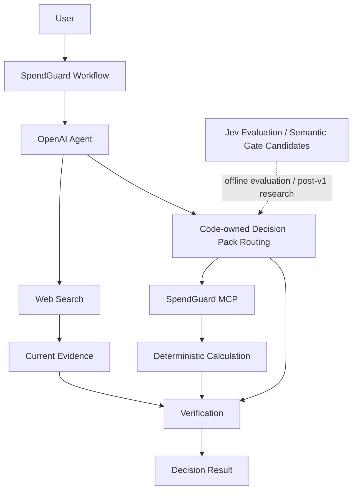

# SpendGuard

### Post-v1 Jev Track A (2026-09-23)

Track A live evaluation scored 11/12 isolated judgments. The paired experimental E2E path reached 2/3 success,
with 6 Agent calls versus 3 for baseline and 0/1 source coverage on both paths. [Track A results](docs/results/track-a-jev-decision-prototyping.md)
> Jev, OpenAI Agent, MCP, Web Search를 분리해 구매·구독·계약·생활비 의사결정을 계산·비교·검증하는 프로젝트

## 개요

SpendGuard는 소비 관련 자연어 질문을 입력받아 필요한 정보 확인, 최신 정보 조사, 결정론적 계산, 선택지 비교를 거쳐 검증 가능한 판단 근거를 제공하는 AI 의사결정 지원 프로젝트입니다.
역할 분리:
- Jev: 좁고 닫힌 semantic judgment 평가 및 후속 Research Track 후보
- OpenAI Agent: 복합 추론, Tool orchestration, 사용자용 설명
- Code: Decision Pack routing, 필수 입력 규칙, workflow 제어
- MCP / Calculation: 계산, 정규화, 비용 비교
- Web Search: 가격·정책·요금제 등 변동 외부 사실 확인
현재 production routing은 OpenAI Agent의 structured intent와 code-owned policy 기반 구성입니다.
Jev `Choice`는 Phase 2에서 OpenAI baseline과 비교 평가 완료 상태이며 production routing에는 미적용 상태입니다. 후속 실험에서는 broad Intent 분류보다 추가 정보 필요 여부, 검색 결과 relevance filtering, 결과 검증 같은 좁은 semantic judgment 적용 가능성 검증 예정입니다.

## 해결하려는 문제

- 소비 질문의 필수 조건 누락
- 할부·대출·TCO·연간 비용 계산의 재현성 부족
- 가격·요금제·정책 등 변동 정보의 최신성 문제
- 근거 없는 추천
- 사실·가정·계산·모델 판단의 혼합
- 모델 판단과 코드 정책의 경계 불명확
- 모든 판단을 하나의 생성형 모델에 위임하는 구조

## 핵심 구조



### 구현 완료

- OpenAI Agent
- Code-owned Decision Pack routing
- Calculation Tool 6종
- FastMCP stdio Server / Client
- Web Search
- Decision Pack 6종
- 초기 절약 시나리오 15종 coverage
- Decision Workspace
- End-to-End Evaluation
- 사용자 중심 Workspace UX 재구성

### 평가 완료

- OpenAI baseline Intent
- Jev `Choice`
- Phase 7 End-to-End workflow

### 의도적 미적용

- Jev production routing
- confidence 단독 production 분기

## 사용자 시나리오 15종

SpendGuard의 사용자 경험은 내부 Decision Pack보다 실제 소비 문제 중심 구성입니다.
| 시나리오 | 처리 목적 |
| --- | --- |
| 최저가 비교 | 동일·유사 제품 가격·조건 비교 |
| 구독료 다이어트 | 중복·저활용 구독과 반복 비용 점검 |
| 통신비 점검 | 사용량과 현재 요금제 기반 비용 비교 |
| 보험 중복 찾기 | 사용자 제공 보장 조건의 중복·과다 여부 비교 |
| 카드 혜택 최적화 | 소비 패턴과 공개 혜택 조건 비교 |
| 충동구매 방지 | 가격·사용 빈도·대체재·기회비용 검토 |
| 장보기 예산 절감 | 예산·인원 기준 식비 구성 비교 |
| 여행비 최적화 | 항공·숙박·교통·식비 절감안 비교 |
| 자동차 유지비 계산 | 보험·세금·연료·정비 등 TCO 계산 |
| 할부 vs 일시불 | 할부 총비용과 일시불 비용 비교 |
| 대출 갈아타기 계산 | 기존·신규 조건의 잔여 비용 비교 |
| 견적서 바가지 체크 | 견적 항목 구조화와 과다 비용 점검 |
| 가격 협상 준비 | 외부 가격·견적 근거 기반 협상 항목 정리 |
| 연간 새는 돈 찾기 | 반복 지출 연간 환산과 절감 후보 확인 |
| 구매 전 최종 심사 | 지금 구매·대기·중고·대체품 비용 비교 |
사용자 UI 원칙:
- 15개 시나리오 명칭의 직접 노출
- 시나리오 버튼 클릭 시 편집 가능한 Prompt Template 입력
- `[제품명]`, `[가격]`, `[기간]` 등 사용자 수정 지점 표시
- 자동 submit 금지
- 내부 Pack 이름의 기본 UI 비노출
- `MCP`, Tool 이름, raw JSON, endpoint 등 구현 세부사항의 기본 UI 비노출
Prompt Template의 상세 문구와 interaction 기준은 `.project/plan.md` 참조.

## Decision Pack

Decision Pack은 사용자 메뉴가 아닌 내부 workflow routing 단위입니다.
| Pack | 처리 대상 |
| --- | --- |
| Purchase | 제품 구매, 중고, 대체재, 구매 시점 |
| Recurring Cost | 구독, 통신비, 반복 지출 |
| Finance Cost | 할부, 대출 변경 |
| Ownership Cost | 자동차 등 장기 보유 비용 |
| Quote Audit | 견적서, 계약 비용 |
| Budget Optimization | 장보기, 여행, 최근 지출 |

## 개발 단계

| Phase | 범위 | 상태 |
| --- | --- | --- |
| Phase 0 | Repository Bootstrap | 완료 |
| Phase 1 | Core Agent Baseline | 완료 |
| Phase 2 | Jev Decision Layer Evaluation | 완료 |
| Phase 3 | Calculation Tools | 완료 |
| Phase 4 | MCP Server | 완료 |
| Phase 4.5 | Decision Workspace UI | 완료 |
| Phase 5 | Current Information Research | 완료 |
| Phase 6 | Decision Packs | 완료 |
| Phase 7 | End-to-End Evaluation | 완료 |

## 개발 및 검증 흐름

```text
Agent baseline
→ Jev 판단 비교
→ 결정론적 계산
→ MCP 연결
→ 실제 화면 구성
→ 최신 정보 조사
→ Decision Pack 확장
→ 전체 평가

```

## Phase 1 검증 결과

OpenAI 기반 baseline의 고정 평가 데이터 17건 검증.
| 항목 | 결과 |
| --- | --- |
| 평가 케이스 | 17 |
| Intent 정답 | 16 |
| Intent 정확도 | 94.12% |
| API 오류 | 0 |
| pytest | 10 passed |
실패 케이스:
- ID: `ambiguous-001`
- expected: `unknown`
- actual: `budget_optimization`
상세 내용: [Phase 1 결과 문서](docs/results/phase1-core-agent.md)

## Phase 2 검증 결과

동일 고정 평가 데이터 17건 기반 Jev `Choice` Intent 분류 검증.
| 항목 | 결과 |
| --- | --- |
| Intent 정답 | 16 |
| Intent 정확도 | 94.12% |
| 평균 지연 시간 | 259.25ms |
| p50 지연 시간 | 238.50ms |
| API 오류 | 0 |
| Usage | Input 8,981 / Output 1,319 |
| 비용 | 계산 기준 $0.000377202 / Dashboard $0.0004 |
실패 케이스:
- ID: `ambiguous-001`
- expected: `unknown`
- actual: `budget_optimization`
- confidence: `0.99`
결론:
- OpenAI baseline 대비 broad Intent 정확도 개선 없음
- Jev production routing 미적용
- confidence threshold 미설정
상세 내용: [Phase 2 결과 문서](docs/results/phase2-jev-decision-layer.md)

## Phase 3 검증 결과

결정론적 비용 계산 Tool 6종 구현.
| 항목 | 결과 |
| --- | --- |
| Calculation Tool | 할부, 대환, 사용당 비용, 연간 환산, TCO, 비용 비교 |
| 반올림 | `Decimal`, 소수점 둘째 자리, `ROUND_HALF_UP` |
| 전체 pytest | 26 passed |
특징:
- 외부 API 호출 없음
- 모델 호출 없음
- 입력·계산식·중간값·결과 추적 가능
상세 내용: [Phase 3 결과 문서](docs/results/phase3-calculation-tools.md)

## Phase 4 검증 결과

FastMCP 4.0.0 기반 stdio MCP Server와 독립 MCP Client 구현.
| 항목 | 결과 |
| --- | --- |
| MCP Tool | 할부, 대환, 사용당 비용, 연간 환산, TCO, 비용 비교 |
| Transport | stdio |
| Direct / MCP 결과 | 입력, 계산식, 중간값, 결과 일치 |
| 전체 pytest | 35 passed |
특징:
- Phase 3 Calculation Tool 6종 재사용
- 입력·출력 schema 검증
- 오류 전달 검증
상세 내용: [Phase 4 결과 문서](docs/results/phase4-mcp-server.md)

## Phase 4.5 검증 결과

Phase 1~4 기능 연결 기반 초기 Decision Workspace 구현.
| 항목 | 결과 |
| --- | --- |
| 화면 | Header, Navigation, Ask, Decision 상태, 결과 Card, Inspector |
| 실제 연결 | OpenAI Agent, Direct Calculation, stdio MCP Calculation |
| Decision 상태 | Needs Input, Calculating, Review, Ready |
| 반응형 | Desktop 1440px, Mobile 500px 검증 |
| 전체 pytest | 41 passed |
Phase 4.5 완료 시점 범위:
- Web Search 미구현
- `Researching` 실제 동작 미구현
- Decision Pack workflow 미구현
상세 내용: [Phase 4.5 결과 문서](docs/results/phase4.5-decision-workspace-ui.md)

## Phase 5 검증 결과

OpenAI Agents SDK `WebSearchTool` 기반 변동 외부 사실 조사.
| 항목 | 결과 |
| --- | --- |
| 출처 추적 | `value`, `source_name`, `source_url`, `retrieved_at` |
| 공식 출처 | Agent 우선 선택 + 실제 Responses citation/source URL 검증 |
| 오류/불확실성 | 결과 없음, 공식 출처 미확인, 상충 정보, 최신성 불명확, Tool 오류 처리 |
| Workspace | 실제 research 요청에만 `Researching`, Sources 링크·조회 시각 표시 |
| 실제 외부 호출 | Apple Korea 공식 source URL / `retrieved_at` 확인 |
원칙:
- 사용자 제공 값 재검색 금지
- 결정론적 계산값 검색 금지
- 외부 사실과 Agent 설명 분리
상세 내용: [Phase 5 결과 문서](docs/results/phase5-current-information-research.md)

## Phase 6 검증 결과

6개 Decision Pack 기반 실제 소비 의사결정 workflow 구성.
| 항목 | 결과 |
| --- | --- |
| Decision Pack | Purchase, Recurring Cost, Finance Cost, Ownership Cost, Quote Audit, Budget Optimization |
| 필수 입력 | Code-owned Required Data 검사 + `needs_input` fallback |
| 계산 | 기존 MCP 6개 Tool 재사용 |
| Tool 오류 | 확정 결론 생성 금지 |
| 외부 사실 | Phase 5 source 구조 재사용 |
| 초기 절약 시나리오 | 15종 coverage 검증 |
제외 범위:
- 자동 구매
- 자동 계약
- 자동 구독 해지
- 금융 계정 연동
- 가격 예측
상세 내용: [Phase 6 결과 문서](docs/results/phase6-decision-packs.md)

## Phase 7 검증 결과

`phase7-v1` 고정 평가 데이터 기반 전체 workflow 검증.
| 항목 | 결과 |
| --- | --- |
| 평가 데이터 | 21건 |
| Code-owned Pack routing | 20 / 20 |
| Calculation Accuracy | 9 / 9 |
| Required Data Accuracy | 20 / 20 |
| Source Coverage | 1 / 1 fixture trace |
| Unsupported Fact | 0건 |
| MCP 오류 처리 | 1 / 1 `tool_error` |
| Web Search 오류 처리 | API 502 |
| End-to-End Success | 20 / 20 |
주의:
- Code-owned routing 20 / 20과 모델 추론 정확도의 분리
- Phase 2 Jev 16 / 17과 Phase 7 workflow 결과의 합산 금지
- Source Coverage 1 / 1의 단일 외부 검색 fixture 범위 한정
- 미측정 Phase 7 비용의 추정 금지
상세 내용: [Phase 7 결과 문서](docs/results/phase7-end-to-end-evaluation.md)

## Decision Workspace UX

현재 사용자 흐름:

```text
Question
→ Required Data
→ Research / Calculation
→ Decision Result
→ Inspector

```

주요 UX 원칙:
- 단일 자연어 질문
- 15개 실제 소비 시나리오 중심 탐색
- 시나리오별 편집 가능한 Prompt Template
- `missing_fields` 기반 추가 입력
- 결과 우선 구조
- 내부 architecture 용어 기본 비노출
- Facts·Calculations·Sources·Assumptions의 Inspector 분리
- Technical Details의 접힌 상세 영역 제한
상세 내용: [UX Refinement 결과 문서](docs/results/chapter-decision-workspace-ux-refinement.md)

## Post-v1 Jev Research

### Track A. Jev Decision Prototyping & Optimization

목표:
- Jev를 저렴한 GPT 대체재가 아닌 빠른 decision prototype으로 활용
- 아직 코드화하기 어려운 작은 semantic judgment의 Day-1 구현
- 실제 실행 로그 기반 판단 구조 분석
- 판단별 Code / 경량 classifier / Jev / OpenAI Agent 재배치
- 품질 유지 조건의 latency / token / 비용 절감
Jev Decision Boundary:
| 판단 유형 | 기본 실행 계층 |
| --- | --- |
| 명확한 규칙 | Code |
| 좁고 애매하며 실패 복구 가능한 판단 | Jev 후보 |
| 복합적이고 열린 판단 | OpenAI Agent |
| 금전 이동·삭제·계약·개인정보 등 고위험 판단 | 사용자 확인 또는 별도 검증 |
핵심 원칙:
- 선택지 밖 정답 가능성 고려
- `unknown`, `none`, `needs_review` 등 abstain 경로 검토
- confidence와 정답 확률의 동일시 금지
- confidence 단독 production action 금지
- 판단 정확도와 action risk 분리
- 고위험 side effect의 Jev 단독 실행 금지
- Jev 사용량 감소도 최적화 성공으로 인정
Automation Level:
| Level | 처리 기준 |
| --- | --- |
| L0 | Code 직접 처리 |
| L1 | Jev 판단 후 자동 처리 가능, 실패 복구 용이 |
| L2 | Jev 판단 후 Agent 검토 |
| L3 | Agent 판단 후 사용자 확인 |
| L4 | 사용자 직접 결정 또는 별도 고위험 검증 |
후속 실험 후보:
1. 추가 정보 필요 여부 판단
2. Web Search 결과 relevance filtering
3. Decision Result 추가 검토 여부 판단
Day-1 이후 최적화 흐름:

```text
Jev typed judgment로 빠른 prototype
→ 실행 로그 축적
→ 오류·confidence·후속 결과 분석
→ 규칙화 가능 영역의 Code 이전
→ 대량 반복 분류의 경량 classifier 검토
→ 좁은 문맥 판단의 Jev 유지
→ 복합 추론의 OpenAI Agent 유지
→ 고위험 판단의 사용자 확인 유지

```

평가 기준:
- Judgment Accuracy
- False Positive / False Negative
- abstain / needs_review 비율
- confidence 구간별 실제 정답률
- OpenAI Agent 호출 수
- OpenAI input token 변화
- Jev / OpenAI / End-to-End latency
- Jev / OpenAI / Total workflow cost
- Source Coverage
- Unsupported Fact
- End-to-End Success
적용 원칙:
- Phase 0~7 구현·평가 결과 변경 금지
- 기존 평가 fixture와 expected label 변경 금지
- Track 전용 신규 평가 데이터 사용
- experimental workflow의 production 선반영 금지
- Code로 해결 가능한 규칙의 Jev 대체 금지
- confidence threshold 사전 임의 설정 금지
- high-risk action의 Jev 단독 자동 실행 금지
- 비용·속도 개선과 품질 저하의 분리 기록
상세 계획: `.project/plan.md`

## 기술 구성

| 구분 | 기술 |
| --- | --- |
| Language | Python 3.13 |
| API | FastAPI |
| Agent | OpenAI Agents SDK |
| LLM API | OpenAI Responses API |
| Decision Model Evaluation | TypeSafe Jev (`typesafe-sdk`) |
| MCP | FastMCP 4.0.0 |
| Validation | Pydantic |
| Test | pytest |
| Frontend | HTML / CSS / JavaScript |

## 실행

Python 3.13과 uv 필요.

```powershell
uv sync --all-groups
uv run uvicorn spendguard.main:app --reload

```

프로젝트 루트 `.env` 설정:

```text
OPENAI_API_KEY=
OPENAI_MODEL=
TYPESAFE_API_KEY=

```

브라우저:
[http://127.0.0.1:8000](http://127.0.0.1:8000)
API 키 또는 모델 설정 누락 시 `/api/analyze`의 `503` 반환.

## 검증

```powershell
uv run pytest
uv run python scripts/evaluate_phase1.py

```

평가 스크립트 기준:
- `evals/phase1_cases.json`
- 고정 평가 데이터 사용

## 프로젝트 구조

```text
spendguard-agent/
├── .agents/
├── .project/
├── docs/
│   ├── instructions/
│   └── results/
├── evals/
├── scripts/
├── src/
├── tests/
├── AGENTS.md
├── DESIGN.md
├── README.md
├── pyproject.toml
└── uv.lock

```

## 문서

| 문서 | 역할 |
| --- | --- |
| `.project/plan.md` | 프로젝트 전체 기획 기준 |
| `AGENTS.md` | 저장소 공통 작업 규칙 |
| `DESIGN.md` | Web UI 디자인 기준 |
| `docs/instructions/` | Phase / Chapter 작업 범위와 완료 기준 |
| `docs/results/` | 실제 구현·검증 결과 |
