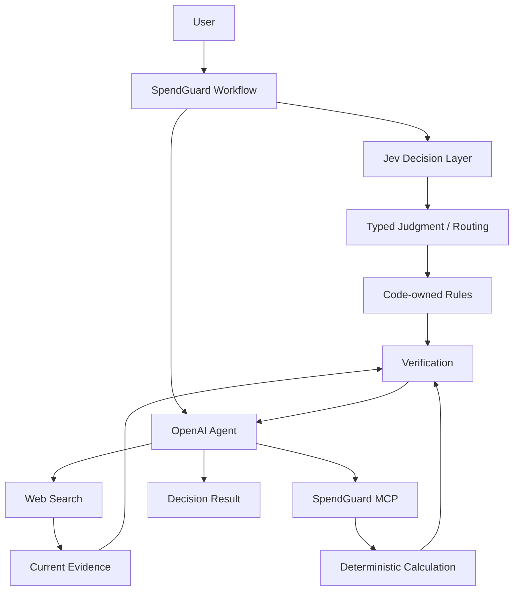

# SpendGuard

> Jev, OpenAI Agent, MCP를 활용해 구매·구독·비용 의사결정을 계산·비교·검증하는 프로젝트

## 개요

SpendGuard는 구매·구독·계약·생활비와 관련된 질문을 분석하고, 필요한 정보 확인·정확한 계산·최신 정보 조사·선택지 비교를 거쳐 검증 가능한 판단 근거를 제공하는 AI 의사결정 프로젝트입니다.

역할을 분리합니다.

- Jev: 정해진 선택지 안에서 수행하는 좁은 의미 판단과 routing
- OpenAI Agent: 복합 추론, Tool orchestration, 사용자용 설명
- MCP / Code: 계산, 정규화, 비교 같은 결정론적 처리
- Web Search: 가격·정책·요금제처럼 변동 가능한 외부 사실 확인

Jev는 Phase 2에서 Phase 1의 OpenAI baseline과 비교 검증한 뒤 적용 범위를 결정합니다.

## 해결하려는 문제

- 소비 관련 질문에서 필요한 조건 누락
- 할부·대출·TCO·연간 절감액 계산 오류 가능성
- 가격·요금제·정책 등 변동 정보의 최신성 문제
- 근거 없는 추천
- 사실·가정·계산·모델 판단의 혼합
- 모든 판단을 하나의 생성형 모델에 맡기는 구조

## 계획 아키텍처



> 현재 Phase 0 상태에서는 위 아키텍처가 구현되어 있지 않습니다.

## 계획 기술 스택

| 구분 | 기술 |
| --- | --- |
| Language | Python 3.13 |
| API | FastAPI |
| Generative Agent | OpenAI Agents SDK |
| LLM API | OpenAI Responses API |
| Decision Model | TypeSafe Jev |
| TypeSafe SDK | `typesafe-sdk` |
| MCP | FastMCP |
| HTTP | HTTPX |
| Validation | Pydantic |
| Test | pytest |
| Frontend | HTML / CSS / JavaScript |

## 프로젝트 구조

```text
spendguard-agent/
├── .agents/
│   └── skills/
│       └── spendguard-phase-workflow/
│           └── SKILL.md
├── .project/
│   └── plan.md
├── docs/
│   └── instructions/
│       └── phase1-core-agent.md
├── .env.example
├── .gitignore
├── AGENTS.md
├── DESIGN.md
└── README.md
```

미래 Phase용 소스 디렉터리와 결과 문서는 미리 생성하지 않습니다.

## 개발 단계

| Phase | 범위 | 상태 |
| --- | --- | --- |
| Phase 0 | Repository Bootstrap | 완료 |
| Phase 1 | Core Agent Baseline | 예정 |
| Phase 2 | Jev Decision Layer Evaluation | 예정 |
| Phase 3 | Calculation Tools | 예정 |
| Phase 4 | MCP Server | 예정 |
| Phase 5 | Current Information Research | 예정 |
| Phase 6 | Decision Packs | 예정 |
| Phase 7 | End-to-End Evaluation | 예정 |

## 현재 실행 상태

아직 실행 가능한 애플리케이션이 없습니다.

Phase 1 구현과 실제 실행 검증이 끝난 뒤 실행 방법을 추가합니다.

## 문서

| 문서 | 역할 |
| --- | --- |
| `.project/plan.md` | 프로젝트 전체 기획 기준 |
| `AGENTS.md` | 저장소 공통 작업 규칙 |
| `DESIGN.md` | Web UI 디자인 기준 |
| `docs/instructions/phase1-core-agent.md` | 현재 Phase 작업 범위와 완료 기준 |
| `.agents/skills/spendguard-phase-workflow/SKILL.md` | Phase 작업 반복 절차 |
